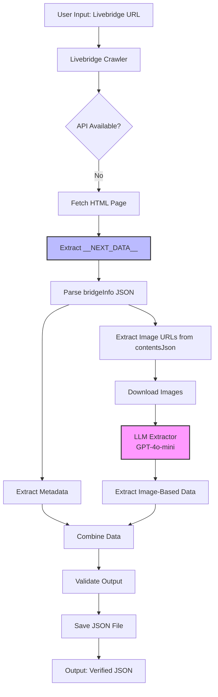
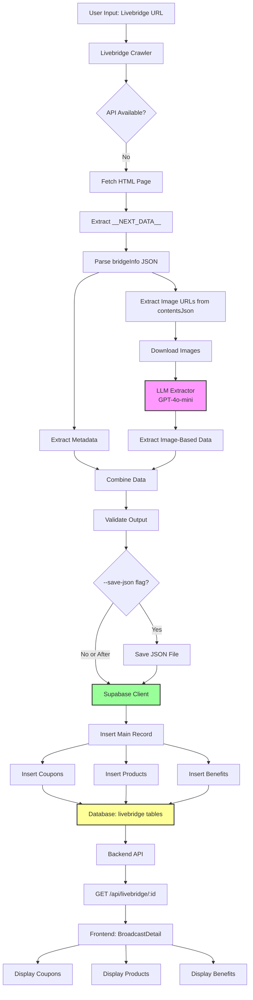

# System Design & Architecture

## Architecture Overview
**What is the high-level system structure?**



### Key Components
1. **Livebridge Crawler**: Main orchestration script
2. **Page Fetcher**: Handles HTTP requests with SSL workarounds
3. **JSON Extractor**: Parses __NEXT_DATA__ from HTML
4. **Metadata Parser**: Extracts direct fields from bridgeInfo
5. **Image Downloader**: Downloads promotional images
6. **LLM Extractor**: Uses GPT-4o-mini for image content extraction
7. **Output Writer**: Generates validated JSON output

### Technology Stack
- **Language**: Python 3.12
- **HTTP Client**: requests (with SSL verification disabled for Naver)
- **HTML Parsing**: BeautifulSoup4 / regex for JSON extraction
- **LLM Integration**: OpenAI API (GPT-4o-mini)
- **Existing Infrastructure**: Reuse `/crawler/cj/llm_extractor.py`

## Data Models
**What data do we need to manage?**

### Output Data Structure
```python
{
    "metadata": {
        "url": str,              # Original livebridge URL
        "broadcast_id": int,     # Unique broadcast identifier
        "crawled_at": str,       # ISO timestamp
        "crawler_version": str   # Version tracking
    },
    "broadcast_info": {
        "title": str,                    # Broadcast title
        "brand_name": str,               # Brand/seller name
        "brand_profile_url": str,        # Brand profile image
        "expected_start_date": str,      # ISO datetime
        "landing_button_title": str,     # CTA button text
        "landing_button_link": str,      # CTA button URL
        "bridge_url": str,               # Canonical livebridge URL
        "broadcaster_url": str,          # Brand/channel page URL
        "background_image": str,         # Mobile background
        "background_image_pc": str       # Desktop background
    },
    "images": [
        {
            "id": str,                   # Component ID from contentsJson
            "url": str,                  # Full image URL
            "filename": str,             # Original filename
            "link": str,                 # Clickable link if present
            "width": int,
            "height": int,
            "file_size": int,
            "position": int              # Order in content
        }
    ],
    "extracted_content": {
        "live_benefits": [               # From LLM extraction
            {
                "benefit_text": str,
                "benefit_type": str,     # e.g., "discount", "gift", "coupon"
                "confidence": float      # LLM confidence score
            }
        ],
        "benefits_by_amount": [          # Tiered benefits
            {
                "purchase_amount": str,  # e.g., "30,000원 이상"
                "benefit": str,
                "confidence": float
            }
        ],
        "coupons": [
            {
                "coupon_name": str,
                "discount_amount": str,  # e.g., "5,000원 할인"
                "conditions": str,
                "expiry": str,
                "confidence": float
            }
        ],
        "products": [
            {
                "product_name": str,
                "discount_rate": str,    # e.g., "40%"
                "discount_price": str,   # e.g., "15,900원"
                "original_price": str,
                "product_url": str,
                "confidence": float
            }
        ]
    },
    "raw_html_content": str,             # Backup: contentsHtml
    "raw_json_content": dict             # Backup: full contentsJson
}
```

### Data Flow
1. **Input**: Livebridge URL (string)
2. **Intermediate**: __NEXT_DATA__ JSON object
3. **Processing**: Downloaded images + LLM prompts
4. **Output**: Structured JSON file

## API Design
**How do components communicate?**

### External APIs
1. **Naver Livebridge Page**
   - URL: `https://shoppinglive.naver.com/livebridge/{id}`
   - Method: GET
   - Response: HTML with embedded __NEXT_DATA__
   - Auth: None required

2. **OpenAI API (GPT-4o-mini)**
   - Endpoint: Chat completions with vision
   - Method: POST
   - Request: Image URL + extraction prompt
   - Response: Structured text extraction
   - Auth: API key from environment

### Internal Interfaces

#### LLMExtractor Interface
```python
from crawler.cj.llm_extractor import LLMExtractor, LLMProvider

extractor = LLMExtractor(provider=LLMProvider.GPT_4O_MINI)

result = extractor.extract_from_image(
    image_url: str,
    prompt: str,
    schema: dict  # Expected output structure
) -> dict
```

#### OutputWriter Interface
```python
from utils.output_writer import OutputWriter

writer = OutputWriter(output_dir="crawler/cj/output")
file_path = writer.write(
    data: dict,
    identifier: str  # broadcast_id
) -> Path
```

## Component Breakdown
**What are the major building blocks?**

### 1. Main Crawler Script (`livebridge_crawler.py`)
- **Responsibility**: Orchestrate the entire extraction process
- **Location**: `/crawler/cj/livebridge_crawler.py`
- **Dependencies**: requests, json, re, llm_extractor

### 2. Page Fetcher (`fetcher.py`)
- **Responsibility**: HTTP requests with SSL handling
- **Key Methods**:
  - `fetch_page(url: str) -> str`: Returns HTML content
  - `extract_next_data(html: str) -> dict`: Parse __NEXT_DATA__

### 3. Metadata Parser (`parsers/livebridge_parser.py`)
- **Responsibility**: Extract direct fields from bridgeInfo
- **Key Methods**:
  - `parse_metadata(bridge_info: dict) -> dict`
  - `parse_images(contents_json: dict) -> List[dict]`

### 4. Image Processor
- **Responsibility**: Download and prepare images for LLM
- **Key Methods**:
  - `download_image(url: str, save_path: Path) -> Path`
  - `prepare_image_for_llm(image_path: Path) -> str`: Base64 encode if needed

### 5. LLM Content Extractor (Reused from CJ)
- **Location**: `/crawler/cj/llm_extractor.py`
- **Responsibility**: Extract structured data from images
- **Prompts**:
  - **Benefits Prompt**: "Extract all promotional benefits from this image..."
  - **Coupons Prompt**: "Extract coupon details including discount amount, conditions..."
  - **Products Prompt**: "Extract product name, discount rate, price..."

### 6. Output Validator & Writer
- **Responsibility**: Validate and save JSON output
- **Validations**:
  - Required fields present
  - Data types correct
  - Dates in ISO format
  - URLs well-formed

## Design Decisions
**Why did we choose this approach?**

### 1. Direct JSON Parsing over HTML Scraping
**Decision**: Parse __NEXT_DATA__ instead of scraping HTML with class selectors

**Rationale**:
- __NEXT_DATA__ is more stable than CSS classes
- Single JSON parse vs multiple DOM queries
- Complete data available in one structure
- Faster and more reliable

**Trade-off**: Dependent on Next.js structure (but confirmed consistent)

### 2. LLM for Image Content vs OCR
**Decision**: Use GPT-4o-mini for image extraction instead of traditional OCR

**Rationale**:
- Proven success with CJ crawler (85-90% accuracy)
- Handles complex layouts and Korean text better than OCR
- Can understand context and structure
- Cost-effective ($0.40/1000 images)

**Trade-off**: API dependency and cost, but worth it for accuracy

### 3. JSON Output First, Database Later
**Decision**: Save to JSON files for verification before database insertion

**Rationale**:
- Allows manual quality check
- Easier debugging and iteration
- Can batch-import verified data
- Safer than direct database writes

**Trade-off**: Extra manual step, but reduces data quality issues

### 4. Single URL Processing
**Decision**: Process one URL at a time, no batch mode initially

**Rationale**:
- Simpler implementation and testing
- Easier error handling and debugging
- Matches CJ crawler pattern
- Can add batch later if needed

**Trade-off**: Less efficient for large-scale crawling

### 5. Reuse Existing LLM Pipeline
**Decision**: Use `/crawler/cj/llm_extractor.py` instead of building new

**Rationale**:
- Already tested and proven
- Consistent with codebase patterns
- Saves development time
- Maintains code consistency

**Trade-off**: None - clear win

## Non-Functional Requirements
**How should the system perform?**

### Performance Targets
- **Page Fetch**: < 3 seconds
- **JSON Parsing**: < 100ms
- **Image Download**: < 2 seconds per image
- **LLM Extraction**: < 5 seconds per image
- **Total Time**: < 60 seconds for typical livebridge page (10 images)

### Scalability Considerations
- Support for future batch processing
- Rate limiting for OpenAI API calls
- Image caching to avoid re-downloading
- Concurrent image processing (future)

### Security Requirements
- API keys stored in environment variables (.env)
- No hardcoded credentials
- SSL verification disabled only for Naver (known issue)
- Sanitize output to prevent JSON injection

### Reliability Requirements
- Graceful handling of missing fields
- Retry logic for network failures (3 attempts)
- Fallback to HTML parsing if __NEXT_DATA__ missing
- Detailed error logging with context

### Error Handling Strategy
1. **Network Errors**: Retry up to 3 times with exponential backoff
2. **Parse Errors**: Log error, save partial data, continue
3. **LLM Errors**: Log failure, mark confidence as 0, continue with next image
4. **Missing Fields**: Use null/empty values, don't fail entire extraction

### Logging & Monitoring
- Log levels: INFO for progress, ERROR for failures
- Structured logging with timestamps
- Save failed extractions for later review
- Track LLM API usage and costs

---

## Phase 2: Database Integration & Frontend Display

### Updated Architecture Overview



### Database Schema Design

Based on optimized JSON structure from `livebridge_1776510_optimized.json`:

#### Table: `livebridge`
Main table storing livebridge metadata.

```sql
CREATE TABLE livebridge (
    id BIGSERIAL PRIMARY KEY,
    url TEXT UNIQUE NOT NULL,
    live_datetime TIMESTAMPTZ,
    title TEXT NOT NULL,
    brand_name TEXT,
    created_at TIMESTAMPTZ DEFAULT NOW(),
    updated_at TIMESTAMPTZ DEFAULT NOW()
);

CREATE INDEX idx_livebridge_url ON livebridge(url);
CREATE INDEX idx_livebridge_datetime ON livebridge(live_datetime);
```

#### Table: `livebridge_coupons`
Stores detailed coupon information.

```sql
CREATE TABLE livebridge_coupons (
    id BIGSERIAL PRIMARY KEY,
    livebridge_id BIGINT NOT NULL REFERENCES livebridge(id) ON DELETE CASCADE,
    coupon_name TEXT NOT NULL,
    coupon_type TEXT,
    benefit_unit TEXT,
    benefit_value INTEGER,
    min_order_amount INTEGER,
    max_discount_amount INTEGER,
    coupon_kind TEXT,
    valid_period_start TIMESTAMPTZ,
    valid_period_end TIMESTAMPTZ,
    availability_status TEXT,
    benefit_status TEXT,
    provider_name TEXT,
    source TEXT,
    created_at TIMESTAMPTZ DEFAULT NOW()
);

CREATE INDEX idx_livebridge_coupons_livebridge_id ON livebridge_coupons(livebridge_id);
```

#### Table: `livebridge_products`
Stores product information with discounts.

```sql
CREATE TABLE livebridge_products (
    id BIGSERIAL PRIMARY KEY,
    livebridge_id BIGINT NOT NULL REFERENCES livebridge(id) ON DELETE CASCADE,
    image TEXT,
    name TEXT NOT NULL,
    discount_rate INTEGER,
    discount_price INTEGER,
    created_at TIMESTAMPTZ DEFAULT NOW()
);

CREATE INDEX idx_livebridge_products_livebridge_id ON livebridge_products(livebridge_id);
```

#### Table: `livebridge_live_benefits`
Stores live-specific benefits.

```sql
CREATE TABLE livebridge_live_benefits (
    id BIGSERIAL PRIMARY KEY,
    livebridge_id BIGINT NOT NULL REFERENCES livebridge(id) ON DELETE CASCADE,
    benefit_text TEXT NOT NULL,
    created_at TIMESTAMPTZ DEFAULT NOW()
);

CREATE INDEX idx_livebridge_live_benefits_livebridge_id ON livebridge_live_benefits(livebridge_id);
```

#### Table: `livebridge_benefits_by_amount`
Stores tiered benefits based on purchase amounts.

```sql
CREATE TABLE livebridge_benefits_by_amount (
    id BIGSERIAL PRIMARY KEY,
    livebridge_id BIGINT NOT NULL REFERENCES livebridge(id) ON DELETE CASCADE,
    benefit_text TEXT NOT NULL,
    created_at TIMESTAMPTZ DEFAULT NOW()
);

CREATE INDEX idx_livebridge_benefits_by_amount_livebridge_id ON livebridge_benefits_by_amount(livebridge_id);
```

#### Table: `livebridge_simple_coupons`
Stores simple coupon descriptions.

```sql
CREATE TABLE livebridge_simple_coupons (
    id BIGSERIAL PRIMARY KEY,
    livebridge_id BIGINT NOT NULL REFERENCES livebridge(id) ON DELETE CASCADE,
    coupon_text TEXT NOT NULL,
    created_at TIMESTAMPTZ DEFAULT NOW()
);

CREATE INDEX idx_livebridge_simple_coupons_livebridge_id ON livebridge_simple_coupons(livebridge_id);
```

### Crawler Supabase Integration

#### Updated Crawler Architecture

**File**: `/crawler/cj/livebridge_crawler.py`

```python
# New imports
from supabase import create_client, Client
import os
from dotenv import load_dotenv

# Initialize Supabase client
load_dotenv()
supabase: Client = create_client(
    os.getenv("SUPABASE_URL"),
    os.getenv("SUPABASE_SERVICE_KEY")
)

def save_to_supabase(data: dict) -> int:
    """
    Save extracted livebridge data to Supabase.
    Returns the livebridge_id.
    """
    # 1. Upsert main livebridge record
    main_data = {
        "url": data["url"],
        "live_datetime": data["live_datetime"],
        "title": data["title"],
        "brand_name": data["brand_name"]
    }

    result = supabase.table("livebridge")\
        .upsert(main_data, on_conflict="url")\
        .execute()

    livebridge_id = result.data[0]["id"]

    # 2. Delete existing related records (for update case)
    supabase.table("livebridge_coupons").delete().eq("livebridge_id", livebridge_id).execute()
    supabase.table("livebridge_products").delete().eq("livebridge_id", livebridge_id).execute()
    supabase.table("livebridge_live_benefits").delete().eq("livebridge_id", livebridge_id).execute()
    supabase.table("livebridge_benefits_by_amount").delete().eq("livebridge_id", livebridge_id).execute()
    supabase.table("livebridge_simple_coupons").delete().eq("livebridge_id", livebridge_id).execute()

    # 3. Insert special coupons
    if data.get("special_coupons"):
        coupons = [
            {**coupon, "livebridge_id": livebridge_id}
            for coupon in data["special_coupons"]
        ]
        supabase.table("livebridge_coupons").insert(coupons).execute()

    # 4. Insert products
    if data.get("products"):
        products = [
            {**product, "livebridge_id": livebridge_id}
            for product in data["products"]
        ]
        supabase.table("livebridge_products").insert(products).execute()

    # 5. Insert live benefits
    if data.get("live_benefits"):
        benefits = [
            {"livebridge_id": livebridge_id, "benefit_text": benefit}
            for benefit in data["live_benefits"]
        ]
        supabase.table("livebridge_live_benefits").insert(benefits).execute()

    # 6. Insert benefits by amount
    if data.get("benefits_by_amount"):
        benefits = [
            {"livebridge_id": livebridge_id, "benefit_text": benefit}
            for benefit in data["benefits_by_amount"]
        ]
        supabase.table("livebridge_benefits_by_amount").insert(benefits).execute()

    # 7. Insert simple coupons
    if data.get("coupons"):
        coupons = [
            {"livebridge_id": livebridge_id, "coupon_text": coupon}
            for coupon in data["coupons"]
        ]
        supabase.table("livebridge_simple_coupons").insert(coupons).execute()

    return livebridge_id
```

#### Command-Line Interface

```python
import argparse

parser = argparse.ArgumentParser(description='Crawl Naver Shopping Live livebridge pages')
parser.add_argument('url', type=str, help='Livebridge URL to crawl')
parser.add_argument('--save-json', action='store_true',
                   help='Save JSON output in addition to Supabase')

args = parser.parse_args()

# ... extraction logic ...

# Save to Supabase (always)
livebridge_id = save_to_supabase(extracted_data)
print(f"Saved to Supabase with ID: {livebridge_id}")

# Save to JSON (optional)
if args.save_json:
    output_path = f"crawler/cj/output/livebridge_{livebridge_id}_optimized.json"
    with open(output_path, 'w', encoding='utf-8') as f:
        json.dump(extracted_data, f, ensure_ascii=False, indent=2)
    print(f"JSON saved to: {output_path}")
```

### Backend API Design

#### New Route: `/api/livebridge`

**File**: `/backend/src/routes/livebridgeRoutes.js`

```javascript
const express = require('express');
const router = express.Router();
const livebridgeService = require('../services/livebridgeService');

// GET /api/livebridge/:id - Get livebridge data by ID
router.get('/:id', async (req, res) => {
  try {
    const { id } = req.params;
    const data = await livebridgeService.getLivebridgeById(id);

    if (!data) {
      return res.status(404).json({
        success: false,
        error: 'Livebridge data not found'
      });
    }

    res.json({ success: true, data });
  } catch (error) {
    console.error('Error fetching livebridge data:', error);
    res.status(500).json({
      success: false,
      error: 'Failed to fetch livebridge data'
    });
  }
});

// GET /api/livebridge/url/:encodedUrl - Get livebridge data by URL
router.get('/url/:encodedUrl', async (req, res) => {
  try {
    const url = decodeURIComponent(req.params.encodedUrl);
    const data = await livebridgeService.getLivebridgeByUrl(url);

    if (!data) {
      return res.status(404).json({
        success: false,
        error: 'Livebridge data not found'
      });
    }

    res.json({ success: true, data });
  } catch (error) {
    console.error('Error fetching livebridge data:', error);
    res.status(500).json({
      success: false,
      error: 'Failed to fetch livebridge data'
    });
  }
});

module.exports = router;
```

#### Service Layer

**File**: `/backend/src/services/livebridgeService.js`

```javascript
const { createClient } = require('@supabase/supabase-js');

const supabase = createClient(
  process.env.SUPABASE_URL,
  process.env.SUPABASE_SERVICE_KEY
);

async function getLivebridgeById(id) {
  // Fetch main record
  const { data: livebridge, error: mainError } = await supabase
    .from('livebridge')
    .select('*')
    .eq('id', id)
    .single();

  if (mainError || !livebridge) return null;

  // Fetch related data in parallel
  const [coupons, products, liveBenefits, benefitsByAmount, simpleCoupons] =
    await Promise.all([
      supabase.from('livebridge_coupons').select('*').eq('livebridge_id', id),
      supabase.from('livebridge_products').select('*').eq('livebridge_id', id),
      supabase.from('livebridge_live_benefits').select('*').eq('livebridge_id', id),
      supabase.from('livebridge_benefits_by_amount').select('*').eq('livebridge_id', id),
      supabase.from('livebridge_simple_coupons').select('*').eq('livebridge_id', id)
    ]);

  return {
    ...livebridge,
    special_coupons: coupons.data || [],
    products: products.data || [],
    live_benefits: liveBenefits.data?.map(b => b.benefit_text) || [],
    benefits_by_amount: benefitsByAmount.data?.map(b => b.benefit_text) || [],
    coupons: simpleCoupons.data?.map(c => c.coupon_text) || []
  };
}

async function getLivebridgeByUrl(url) {
  const { data: livebridge, error } = await supabase
    .from('livebridge')
    .select('*')
    .eq('url', url)
    .single();

  if (error || !livebridge) return null;

  return getLivebridgeById(livebridge.id);
}

module.exports = {
  getLivebridgeById,
  getLivebridgeByUrl
};
```

### Frontend Components Design

#### Component Structure

**File**: `/frontend/src/components/livebridge/LivebridgeData.jsx`

```jsx
import React from 'react';

const LivebridgeData = ({ livebridgeId }) => {
  const [data, setData] = React.useState(null);
  const [loading, setLoading] = React.useState(true);
  const [error, setError] = React.useState(null);

  React.useEffect(() => {
    fetch(`/api/livebridge/${livebridgeId}`)
      .then(res => res.json())
      .then(result => {
        if (result.success) {
          setData(result.data);
        } else {
          setError('Failed to load livebridge data');
        }
      })
      .catch(err => setError(err.message))
      .finally(() => setLoading(false));
  }, [livebridgeId]);

  if (loading) return <div>Loading...</div>;
  if (error) return null; // Fail silently
  if (!data) return null;

  return (
    <div className="livebridge-data">
      {/* Special Coupons Section */}
      {data.special_coupons?.length > 0 && (
        <CouponsSection coupons={data.special_coupons} />
      )}

      {/* Products Section */}
      {data.products?.length > 0 && (
        <ProductsSection products={data.products} />
      )}

      {/* Benefits Section */}
      {(data.live_benefits?.length > 0 || data.benefits_by_amount?.length > 0) && (
        <BenefitsSection
          liveBenefits={data.live_benefits}
          benefitsByAmount={data.benefits_by_amount}
        />
      )}

      {/* Simple Coupons Section */}
      {data.coupons?.length > 0 && (
        <SimpleCouponsSection coupons={data.coupons} />
      )}
    </div>
  );
};

export default LivebridgeData;
```

#### Integration with BroadcastDetail

**File**: `/frontend/src/pages/LiveBroadcastDetail.jsx`

```jsx
import LivebridgeData from '../components/livebridge/LivebridgeData';

// In the component
return (
  <div className="broadcast-detail">
    {/* Existing broadcast info */}

    {/* Add livebridge data section */}
    {broadcast.livebridge_id && (
      <LivebridgeData livebridgeId={broadcast.livebridge_id} />
    )}
  </div>
);
```

### Design Decisions - Phase 2

#### 1. Direct Crawler → Supabase Integration
**Decision**: Integrate Supabase client directly into crawler script

**Rationale**:
- Eliminates manual import step
- Data immediately available for frontend
- Simpler workflow for users
- Reduces human error

**Trade-off**: Requires Supabase credentials in crawler environment

#### 2. Optional JSON Output via Flag
**Decision**: Use `--save-json` flag for optional JSON file output

**Rationale**:
- Default behavior is clean (Supabase only)
- Debugging option available when needed
- Backwards compatible with Phase 1 verification workflow
- Users choose based on need

**Trade-off**: None - strictly additive feature

#### 3. Upsert Strategy for Duplicates
**Decision**: Upsert on `url` field with delete-and-reinsert for related tables

**Rationale**:
- Prevents duplicate livebridge records
- Always keeps latest data
- Simpler than complex update logic
- CASCADE deletes handle cleanup

**Trade-off**: Loses historical data (acceptable for this use case)

#### 4. Normalized Database Design
**Decision**: Separate tables for coupons, products, and benefits

**Rationale**:
- Proper relational design
- Easier to query specific data types
- Supports future analytics
- Follows database best practices

**Trade-off**: More complex queries (mitigated by service layer)

#### 5. Service Layer for API
**Decision**: Create dedicated livebridgeService.js

**Rationale**:
- Follows existing backend patterns
- Separates business logic from routes
- Easier to test and maintain
- Reusable across endpoints

**Trade-off**: None - standard architecture pattern

### Non-Functional Requirements - Phase 2

#### Performance
- **Database Query**: < 200ms for full livebridge data retrieval
- **API Response**: < 500ms end-to-end
- **Frontend Render**: < 100ms after data received
- **Crawler Save**: < 2 seconds for Supabase insertion

#### Security
- Use Supabase service key (not anon key) in backend
- Validate all input data before database insertion
- Sanitize URLs to prevent injection
- Use parameterized queries (Supabase handles this)

#### Reliability
- Graceful degradation if livebridge data missing
- Retry logic for Supabase connection failures (3 attempts)
- Transaction-like behavior (all or nothing for related records)
- Detailed error logging for debugging
