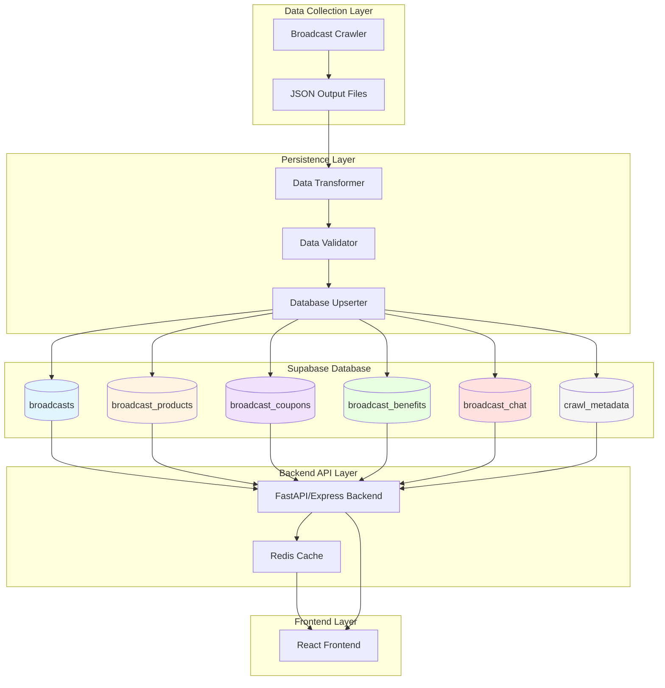
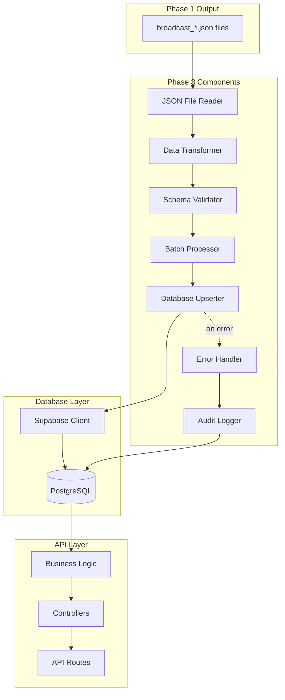
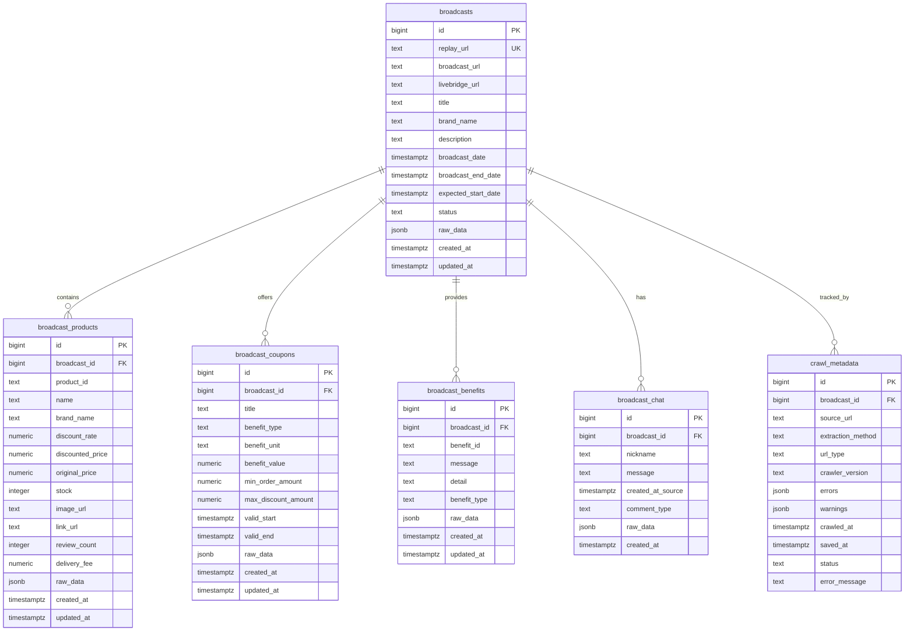
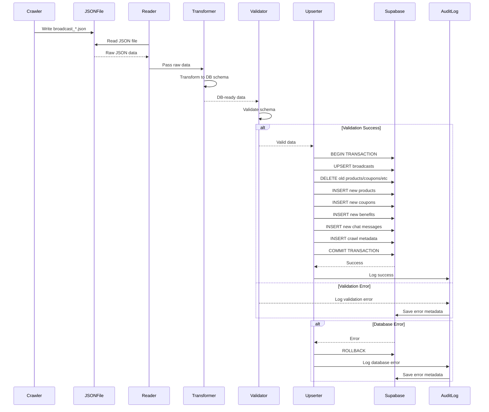
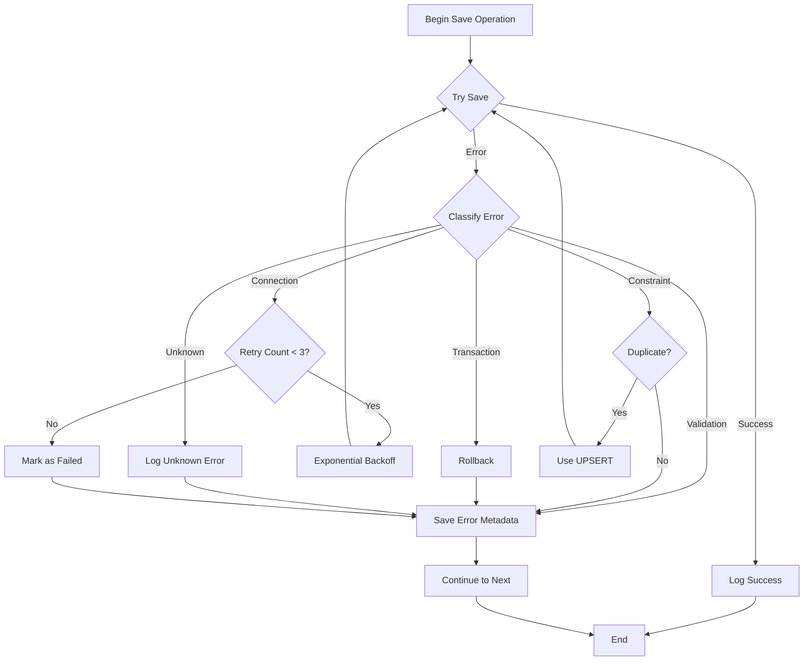

# Design: Naver Shopping Live Crawler - Phase 3 (Database Integration & Persistence)

**Feature Name:** Naver Shopping Live Crawler - Database Integration
**Phase:** Phase 3
**Date:** 2025-12-23
**Status:** Draft
**Version:** 1.0.0
**Depends On:** Phase 1 (Single Broadcast Crawler), Phase 2 (Multi-Broadcast Crawler)

---

## Table of Contents
1. [Architecture Overview](#architecture-overview)
2. [System Components](#system-components)
3. [Database Schema Design](#database-schema-design)
4. [Data Flow](#data-flow)
5. [Integration Architecture](#integration-architecture)
6. [API Design](#api-design)
7. [Error Handling & Recovery](#error-handling--recovery)
8. [Performance & Optimization](#performance--optimization)
9. [Security Considerations](#security-considerations)
10. [Technical Decisions](#technical-decisions)

---

## Architecture Overview

### High-Level Architecture



### Design Principles

1. **Separation of Concerns**: Crawler, persistence, and API are independent layers
2. **Idempotency**: Duplicate saves should update, not duplicate data
3. **Data Integrity**: Foreign key constraints and validation ensure consistency
4. **Scalability**: Designed for thousands of broadcasts with millions of products
5. **Auditability**: Track all crawl operations and data changes
6. **Performance**: Batch operations and caching for optimal speed

---

## System Components

### Component Diagram



### Component Responsibilities

| Component | Responsibility | Input | Output |
|-----------|---------------|-------|--------|
| `JSONFileReader` | Read crawler output files | File path | Python dict |
| `DataTransformer` | Transform crawler format to DB format | Crawler dict | DB-ready dict |
| `SchemaValidator` | Validate data against DB schema | Dict | Validated dict or errors |
| `BatchProcessor` | Group operations for efficient DB writes | List of records | Batched operations |
| `DatabaseUpserter` | Insert/update records in Supabase | Records | Success/failure status |
| `ErrorHandler` | Handle and log persistence errors | Exception | Error record |
| `AuditLogger` | Track all persistence operations | Operation metadata | Audit log entry |
| `SupabaseClient` | Manage database connections | Config | DB client |

---

## Database Schema Design

### Entity Relationship Diagram



### Table Schemas (SQL DDL)

```sql
-- ========================================
-- Core Broadcasts Table
-- ========================================
CREATE TABLE IF NOT EXISTS broadcasts (
    id BIGINT PRIMARY KEY,
    replay_url TEXT UNIQUE NOT NULL,
    broadcast_url TEXT,
    livebridge_url TEXT NOT NULL,
    title TEXT NOT NULL,
    brand_name TEXT NOT NULL,
    description TEXT,
    broadcast_date TIMESTAMPTZ,
    broadcast_end_date TIMESTAMPTZ,
    expected_start_date TIMESTAMPTZ,
    status TEXT,
    raw_data JSONB,
    created_at TIMESTAMPTZ DEFAULT NOW(),
    updated_at TIMESTAMPTZ DEFAULT NOW()
);

-- Indexes for broadcasts
CREATE INDEX idx_broadcasts_brand_name ON broadcasts(brand_name);
CREATE INDEX idx_broadcasts_status ON broadcasts(status);
CREATE INDEX idx_broadcasts_broadcast_date ON broadcasts(broadcast_date DESC);
CREATE INDEX idx_broadcasts_created_at ON broadcasts(created_at DESC);

-- ========================================
-- Broadcast Products Table
-- ========================================
CREATE TABLE IF NOT EXISTS broadcast_products (
    id BIGSERIAL PRIMARY KEY,
    broadcast_id BIGINT NOT NULL REFERENCES broadcasts(id) ON DELETE CASCADE,
    product_id TEXT NOT NULL,
    name TEXT NOT NULL,
    brand_name TEXT,
    discount_rate NUMERIC(5,2),
    discounted_price NUMERIC(12,2),
    original_price NUMERIC(12,2),
    stock INTEGER,
    image_url TEXT,
    link_url TEXT,
    review_count INTEGER,
    delivery_fee NUMERIC(10,2),
    raw_data JSONB,
    created_at TIMESTAMPTZ DEFAULT NOW(),
    updated_at TIMESTAMPTZ DEFAULT NOW(),
    UNIQUE(broadcast_id, product_id)
);

-- Indexes for products
CREATE INDEX idx_products_broadcast_id ON broadcast_products(broadcast_id);
CREATE INDEX idx_products_product_id ON broadcast_products(product_id);
CREATE INDEX idx_products_discount_rate ON broadcast_products(discount_rate DESC);

-- ========================================
-- Broadcast Coupons Table
-- ========================================
CREATE TABLE IF NOT EXISTS broadcast_coupons (
    id BIGSERIAL PRIMARY KEY,
    broadcast_id BIGINT NOT NULL REFERENCES broadcasts(id) ON DELETE CASCADE,
    title TEXT NOT NULL,
    benefit_type TEXT,
    benefit_unit TEXT,
    benefit_value NUMERIC(10,2),
    min_order_amount NUMERIC(12,2),
    max_discount_amount NUMERIC(12,2),
    valid_start TIMESTAMPTZ,
    valid_end TIMESTAMPTZ,
    raw_data JSONB,
    created_at TIMESTAMPTZ DEFAULT NOW(),
    updated_at TIMESTAMPTZ DEFAULT NOW()
);

-- Indexes for coupons
CREATE INDEX idx_coupons_broadcast_id ON broadcast_coupons(broadcast_id);
CREATE INDEX idx_coupons_valid_end ON broadcast_coupons(valid_end DESC);

-- ========================================
-- Broadcast Benefits Table
-- ========================================
CREATE TABLE IF NOT EXISTS broadcast_benefits (
    id BIGSERIAL PRIMARY KEY,
    broadcast_id BIGINT NOT NULL REFERENCES broadcasts(id) ON DELETE CASCADE,
    benefit_id TEXT,
    message TEXT NOT NULL,
    detail TEXT,
    benefit_type TEXT,
    raw_data JSONB,
    created_at TIMESTAMPTZ DEFAULT NOW(),
    updated_at TIMESTAMPTZ DEFAULT NOW(),
    UNIQUE(broadcast_id, benefit_id)
);

-- Indexes for benefits
CREATE INDEX idx_benefits_broadcast_id ON broadcast_benefits(broadcast_id);

-- ========================================
-- Broadcast Chat Table
-- ========================================
CREATE TABLE IF NOT EXISTS broadcast_chat (
    id BIGSERIAL PRIMARY KEY,
    broadcast_id BIGINT NOT NULL REFERENCES broadcasts(id) ON DELETE CASCADE,
    nickname TEXT,
    message TEXT NOT NULL,
    created_at_source TIMESTAMPTZ,
    comment_type TEXT,
    raw_data JSONB,
    created_at TIMESTAMPTZ DEFAULT NOW()
);

-- Indexes for chat
CREATE INDEX idx_chat_broadcast_id ON broadcast_chat(broadcast_id);
CREATE INDEX idx_chat_created_at_source ON broadcast_chat(created_at_source DESC);

-- ========================================
-- Crawl Metadata Table
-- ========================================
CREATE TABLE IF NOT EXISTS crawl_metadata (
    id BIGSERIAL PRIMARY KEY,
    broadcast_id BIGINT NOT NULL REFERENCES broadcasts(id) ON DELETE CASCADE,
    source_url TEXT NOT NULL,
    extraction_method TEXT,
    url_type TEXT,
    crawler_version TEXT,
    errors JSONB,
    warnings JSONB,
    crawled_at TIMESTAMPTZ NOT NULL,
    saved_at TIMESTAMPTZ DEFAULT NOW(),
    status TEXT DEFAULT 'success',
    error_message TEXT
);

-- Indexes for metadata
CREATE INDEX idx_metadata_broadcast_id ON crawl_metadata(broadcast_id);
CREATE INDEX idx_metadata_crawled_at ON crawl_metadata(crawled_at DESC);
CREATE INDEX idx_metadata_status ON crawl_metadata(status);

-- ========================================
-- Triggers for updated_at
-- ========================================
CREATE OR REPLACE FUNCTION update_updated_at_column()
RETURNS TRIGGER AS $$
BEGIN
    NEW.updated_at = NOW();
    RETURN NEW;
END;
$$ language 'plpgsql';

CREATE TRIGGER update_broadcasts_updated_at BEFORE UPDATE ON broadcasts
    FOR EACH ROW EXECUTE FUNCTION update_updated_at_column();

CREATE TRIGGER update_products_updated_at BEFORE UPDATE ON broadcast_products
    FOR EACH ROW EXECUTE FUNCTION update_updated_at_column();

CREATE TRIGGER update_coupons_updated_at BEFORE UPDATE ON broadcast_coupons
    FOR EACH ROW EXECUTE FUNCTION update_updated_at_column();

CREATE TRIGGER update_benefits_updated_at BEFORE UPDATE ON broadcast_benefits
    FOR EACH ROW EXECUTE FUNCTION update_updated_at_column();
```

### Schema Design Decisions

#### Primary Keys
- `broadcasts.id`: Use broadcast ID from Naver (natural key)
- Other tables: Use auto-incrementing `BIGSERIAL` for surrogate keys

#### Unique Constraints
- `broadcasts.replay_url`: Prevent duplicate broadcasts
- `broadcast_products(broadcast_id, product_id)`: One product per broadcast
- `broadcast_benefits(broadcast_id, benefit_id)`: One benefit per broadcast

#### Foreign Keys
- All child tables reference `broadcasts.id` with `ON DELETE CASCADE`
- Ensures referential integrity and automatic cleanup

#### JSONB Columns
- `raw_data`: Store complete original JSON for debugging/auditing
- `errors`/`warnings`: Store structured error information
- Allows flexibility without schema changes

#### Indexes
- Foreign keys (for joins)
- Filter columns (status, dates, brand_name)
- Sort columns (broadcast_date DESC, created_at DESC)

---

## Data Flow

### Persistence Flow Diagram



### Data Transformation Example

**Input (Crawler JSON):**
```json
{
  "metadata": {
    "crawled_at": "2025-12-23T14:30:00.000Z",
    "source_url": "https://view.shoppinglive.naver.com/replays/1776510",
    "extraction_method": "API",
    "url_type": "replays",
    "crawler_version": "1.0.0"
  },
  "broadcast": {
    "broadcast_id": 1776510,
    "title": "Test Broadcast",
    "brand_name": "Test Brand",
    "products": [
      {
        "product_id": "12345",
        "name": "Test Product",
        "discounted_price": 10000
      }
    ]
  }
}
```

**Output (Database Records):**

```python
# broadcasts table
{
    "id": 1776510,
    "title": "Test Broadcast",
    "brand_name": "Test Brand",
    "replay_url": "https://view.shoppinglive.naver.com/replays/1776510",
    "livebridge_url": "https://shoppinglive.naver.com/livebridge/1776510",
    "raw_data": {...},  # Full original JSON
    "created_at": "2025-12-23T14:35:00.000Z",
    "updated_at": "2025-12-23T14:35:00.000Z"
}

# broadcast_products table
{
    "broadcast_id": 1776510,
    "product_id": "12345",
    "name": "Test Product",
    "discounted_price": 10000.00,
    "raw_data": {...},
    "created_at": "2025-12-23T14:35:00.000Z"
}

# crawl_metadata table
{
    "broadcast_id": 1776510,
    "source_url": "https://view.shoppinglive.naver.com/replays/1776510",
    "extraction_method": "API",
    "url_type": "replays",
    "crawler_version": "1.0.0",
    "crawled_at": "2025-12-23T14:30:00.000Z",
    "saved_at": "2025-12-23T14:35:00.000Z",
    "status": "success"
}
```

---

## Integration Architecture

### Class Design

```python
# ========================================
# Data Layer Classes
# ========================================

class SupabaseConfig:
    """Configuration for Supabase connection"""
    def __init__(self, url: str, key: str):
        self.url = url
        self.key = key


class SupabaseClient:
    """Manages Supabase database connection"""
    def __init__(self, config: SupabaseConfig):
        self.config = config
        self.client = None

    def connect(self):
        """Establish connection to Supabase"""
        from supabase import create_client
        self.client = create_client(self.config.url, self.config.key)

    def disconnect(self):
        """Close connection"""
        pass  # Supabase client doesn't need explicit disconnect


class DataTransformer:
    """Transform crawler JSON to database schema"""

    @staticmethod
    def transform_broadcast(crawler_data: dict) -> dict:
        """Transform broadcast data"""
        broadcast = crawler_data['broadcast']
        metadata = crawler_data['metadata']

        return {
            'id': broadcast['broadcast_id'],
            'replay_url': broadcast.get('replay_url'),
            'broadcast_url': broadcast.get('broadcast_url'),
            'livebridge_url': broadcast.get('livebridge_url'),
            'title': broadcast['title'],
            'brand_name': broadcast['brand_name'],
            'description': broadcast.get('description'),
            'broadcast_date': broadcast.get('broadcast_date'),
            'broadcast_end_date': broadcast.get('broadcast_end_date'),
            'expected_start_date': broadcast.get('expected_start_date'),
            'status': broadcast.get('status'),
            'raw_data': crawler_data  # Store full original
        }

    @staticmethod
    def transform_products(broadcast_id: int, products: list) -> list:
        """Transform products data"""
        return [
            {
                'broadcast_id': broadcast_id,
                'product_id': p['product_id'],
                'name': p['name'],
                'brand_name': p.get('brand_name'),
                'discount_rate': p.get('discount_rate'),
                'discounted_price': p.get('discounted_price'),
                'original_price': p.get('original_price'),
                'stock': p.get('stock'),
                'image_url': p.get('image'),
                'link_url': p.get('link'),
                'review_count': p.get('review_count'),
                'delivery_fee': p.get('delivery_fee'),
                'raw_data': p
            }
            for p in products
        ]

    @staticmethod
    def transform_coupons(broadcast_id: int, coupons: list) -> list:
        """Transform coupons data"""
        return [
            {
                'broadcast_id': broadcast_id,
                'title': c['title'],
                'benefit_type': c.get('benefit_type'),
                'benefit_unit': c.get('benefit_unit'),
                'benefit_value': c.get('benefit_value'),
                'min_order_amount': c.get('min_order_amount'),
                'max_discount_amount': c.get('max_discount_amount'),
                'valid_start': c.get('valid_start'),
                'valid_end': c.get('valid_end'),
                'raw_data': c
            }
            for c in coupons
        ]

    # Similar methods for benefits, chat, metadata


class SchemaValidator:
    """Validate data against database schema"""

    @staticmethod
    def validate_broadcast(data: dict) -> tuple[bool, list]:
        """Validate broadcast record"""
        errors = []

        # Required fields
        if not data.get('id'):
            errors.append("Missing required field: id")
        if not data.get('title'):
            errors.append("Missing required field: title")
        if not data.get('brand_name'):
            errors.append("Missing required field: brand_name")
        if not data.get('replay_url'):
            errors.append("Missing required field: replay_url")

        # Type validation
        if data.get('id') and not isinstance(data['id'], int):
            errors.append("Field 'id' must be integer")

        return len(errors) == 0, errors

    # Similar validation methods for other entities


class DatabaseUpserter:
    """Insert/update records in Supabase"""

    def __init__(self, client: SupabaseClient):
        self.client = client

    async def upsert_broadcast_data(self, crawler_data: dict) -> dict:
        """
        Upsert complete broadcast data (broadcast + products + coupons + etc)
        Returns: {status, broadcast_id, records_saved, errors}
        """
        try:
            # Transform data
            broadcast = DataTransformer.transform_broadcast(crawler_data)
            broadcast_id = broadcast['id']

            products = DataTransformer.transform_products(
                broadcast_id,
                crawler_data['broadcast'].get('products', [])
            )
            coupons = DataTransformer.transform_coupons(
                broadcast_id,
                crawler_data['broadcast'].get('coupons', [])
            )
            # ... similar for benefits, chat, metadata

            # Validate
            valid, errors = SchemaValidator.validate_broadcast(broadcast)
            if not valid:
                raise ValueError(f"Validation errors: {errors}")

            # Upsert in transaction
            # 1. Upsert broadcast
            self.client.client.table('broadcasts').upsert(broadcast).execute()

            # 2. Delete old child records
            self.client.client.table('broadcast_products')\
                .delete().eq('broadcast_id', broadcast_id).execute()

            # 3. Insert new child records
            if products:
                self.client.client.table('broadcast_products')\
                    .insert(products).execute()

            if coupons:
                self.client.client.table('broadcast_coupons')\
                    .insert(coupons).execute()

            # 4. Insert metadata
            metadata = DataTransformer.transform_metadata(crawler_data)
            self.client.client.table('crawl_metadata')\
                .insert(metadata).execute()

            return {
                'status': 'success',
                'broadcast_id': broadcast_id,
                'records_saved': {
                    'products': len(products),
                    'coupons': len(coupons),
                    # ...
                }
            }

        except Exception as e:
            # Log error
            error_metadata = {
                'broadcast_id': crawler_data['broadcast']['broadcast_id'],
                'source_url': crawler_data['metadata']['source_url'],
                'crawled_at': crawler_data['metadata']['crawled_at'],
                'saved_at': datetime.utcnow().isoformat(),
                'status': 'error',
                'error_message': str(e)
            }

            try:
                self.client.client.table('crawl_metadata')\
                    .insert(error_metadata).execute()
            except:
                pass  # If even metadata save fails, just log

            return {
                'status': 'error',
                'broadcast_id': crawler_data['broadcast']['broadcast_id'],
                'error': str(e)
            }


class BroadcastSaver:
    """High-level interface for saving broadcast data"""

    def __init__(self, supabase_url: str, supabase_key: str):
        config = SupabaseConfig(supabase_url, supabase_key)
        self.client = SupabaseClient(config)
        self.upserter = DatabaseUpserter(self.client)

    async def save_from_json_file(self, json_file_path: str) -> dict:
        """Save broadcast data from JSON file"""
        import json

        with open(json_file_path, 'r', encoding='utf-8') as f:
            crawler_data = json.load(f)

        return await self.upserter.upsert_broadcast_data(crawler_data)

    async def save_from_dict(self, crawler_data: dict) -> dict:
        """Save broadcast data from dict"""
        return await self.upserter.upsert_broadcast_data(crawler_data)
```

### File Structure

```
crawler/cj/
├── naver_broadcast_crawler.py     # Phase 1 crawler
├── persistence/
│   ├── __init__.py
│   ├── config.py                  # SupabaseConfig
│   ├── client.py                  # SupabaseClient
│   ├── transformer.py             # DataTransformer
│   ├── validator.py               # SchemaValidator
│   ├── upserter.py                # DatabaseUpserter
│   └── saver.py                   # BroadcastSaver (main interface)
├── scripts/
│   ├── save_to_supabase.py        # CLI script to save JSON to DB
│   ├── bulk_save.py               # Batch save multiple JSONs
│   └── verify_data.py             # Verify data integrity
└── output/
    └── broadcast_*.json           # Crawler outputs
```

---

## API Design

### REST API Endpoints

```python
# ========================================
# API Endpoints (FastAPI/Express)
# ========================================

# Get single broadcast
GET /api/broadcasts/:id
Response: {
    "id": 1776510,
    "title": "...",
    "brand_name": "...",
    "products": [...],
    "coupons": [...],
    "benefits": [...],
    "chat": [...]
}

# List broadcasts with pagination
GET /api/broadcasts?page=1&limit=20&brand=아이오페&status=BLOCK
Response: {
    "data": [...],
    "pagination": {
        "page": 1,
        "limit": 20,
        "total": 150,
        "pages": 8
    }
}

# Get broadcast products
GET /api/broadcasts/:id/products
Response: {
    "broadcast_id": 1776510,
    "products": [...]
}

# Get broadcast coupons
GET /api/broadcasts/:id/coupons
Response: {
    "broadcast_id": 1776510,
    "coupons": [...]
}

# Get broadcast metadata
GET /api/broadcasts/:id/metadata
Response: {
    "broadcast_id": 1776510,
    "crawl_history": [
        {
            "crawled_at": "...",
            "status": "success",
            "extraction_method": "API"
        }
    ]
}

# Search broadcasts
GET /api/broadcasts/search?q=크리스마스&brand=아이오페
Response: {
    "query": "크리스마스",
    "results": [...]
}

# Get crawl statistics
GET /api/stats
Response: {
    "total_broadcasts": 1250,
    "total_products": 45000,
    "total_coupons": 3200,
    "last_crawl": "2025-12-23T14:30:00Z",
    "broadcasts_by_status": {
        "BLOCK": 800,
        "ONAIR": 50,
        "READY": 400
    }
}
```

### API Implementation (FastAPI Example)

```python
from fastapi import FastAPI, Query, HTTPException
from supabase import create_client
from typing import Optional

app = FastAPI()

# Initialize Supabase client
supabase = create_client(SUPABASE_URL, SUPABASE_KEY)

@app.get("/api/broadcasts/{broadcast_id}")
async def get_broadcast(broadcast_id: int):
    """Get single broadcast with all related data"""

    # Get broadcast
    broadcast = supabase.table('broadcasts')\
        .select('*')\
        .eq('id', broadcast_id)\
        .single()\
        .execute()

    if not broadcast.data:
        raise HTTPException(status_code=404, detail="Broadcast not found")

    # Get products
    products = supabase.table('broadcast_products')\
        .select('*')\
        .eq('broadcast_id', broadcast_id)\
        .execute()

    # Get coupons
    coupons = supabase.table('broadcast_coupons')\
        .select('*')\
        .eq('broadcast_id', broadcast_id)\
        .execute()

    # Get benefits
    benefits = supabase.table('broadcast_benefits')\
        .select('*')\
        .eq('broadcast_id', broadcast_id)\
        .execute()

    # Get chat (limit to recent 100)
    chat = supabase.table('broadcast_chat')\
        .select('*')\
        .eq('broadcast_id', broadcast_id)\
        .order('created_at_source', desc=True)\
        .limit(100)\
        .execute()

    return {
        **broadcast.data,
        'products': products.data,
        'coupons': coupons.data,
        'benefits': benefits.data,
        'chat': chat.data
    }


@app.get("/api/broadcasts")
async def list_broadcasts(
    page: int = Query(1, ge=1),
    limit: int = Query(20, ge=1, le=100),
    brand: Optional[str] = None,
    status: Optional[str] = None
):
    """List broadcasts with pagination and filters"""

    query = supabase.table('broadcasts').select('*', count='exact')

    if brand:
        query = query.ilike('brand_name', f'%{brand}%')
    if status:
        query = query.eq('status', status)

    # Calculate offset
    offset = (page - 1) * limit

    # Execute query
    result = query.order('broadcast_date', desc=True)\
        .range(offset, offset + limit - 1)\
        .execute()

    total = result.count
    pages = (total + limit - 1) // limit

    return {
        'data': result.data,
        'pagination': {
            'page': page,
            'limit': limit,
            'total': total,
            'pages': pages
        }
    }
```

---

## Error Handling & Recovery

### Error Categories

| Category | Handling Strategy | Recovery Action |
|----------|------------------|-----------------|
| **Connection Error** | Retry with exponential backoff | Retry up to 3 times, then fail |
| **Validation Error** | Log and skip record | Save error to metadata table |
| **Constraint Violation** | Check if duplicate, update if so | Use UPSERT instead of INSERT |
| **Transaction Error** | Rollback and log | Save error metadata, continue with next |
| **Missing Required Field** | Skip record, log warning | Save partial data if possible |
| **API Rate Limit** | Back off and retry | Wait specified time, retry |

### Error Flow Diagram



### Retry Strategy

```python
import time
from functools import wraps

def retry_with_backoff(max_retries=3, base_delay=1):
    """Decorator for retry with exponential backoff"""
    def decorator(func):
        @wraps(func)
        async def wrapper(*args, **kwargs):
            for attempt in range(max_retries):
                try:
                    return await func(*args, **kwargs)
                except ConnectionError as e:
                    if attempt == max_retries - 1:
                        raise
                    delay = base_delay * (2 ** attempt)
                    print(f"Connection error, retrying in {delay}s... (attempt {attempt + 1}/{max_retries})")
                    time.sleep(delay)
            return None
        return wrapper
    return decorator


class ErrorLogger:
    """Log errors to database and file"""

    def __init__(self, client: SupabaseClient):
        self.client = client

    def log_error(self, broadcast_id: int, error: Exception, context: dict):
        """Log error to database and local log file"""
        error_record = {
            'broadcast_id': broadcast_id,
            'source_url': context.get('source_url'),
            'crawled_at': context.get('crawled_at'),
            'saved_at': datetime.utcnow().isoformat(),
            'status': 'error',
            'error_message': str(error),
            'errors': {
                'type': type(error).__name__,
                'message': str(error),
                'traceback': traceback.format_exc()
            }
        }

        # Save to database
        try:
            self.client.client.table('crawl_metadata').insert(error_record).execute()
        except Exception as db_error:
            # If database save fails, at least log to file
            with open('persistence_errors.log', 'a') as f:
                f.write(f"{datetime.utcnow()}: {error_record}\n")
```

---

## Performance & Optimization

### Performance Targets

| Operation | Target | Notes |
|-----------|--------|-------|
| Single broadcast save | < 2 seconds | Including all child records |
| Batch save (100 broadcasts) | < 60 seconds | ~0.6s per broadcast |
| Read single broadcast | < 500ms | With all related data |
| List broadcasts (paginated) | < 300ms | Page of 20 items |
| Search broadcasts | < 1 second | Full-text search |

### Optimization Strategies

#### 1. Batch Operations

```python
class BatchUpserter:
    """Efficient batch upsert for multiple broadcasts"""

    async def upsert_batch(self, crawler_data_list: list) -> dict:
        """Save multiple broadcasts efficiently"""

        broadcasts = []
        all_products = []
        all_coupons = []

        # Transform all data first
        for data in crawler_data_list:
            broadcast = DataTransformer.transform_broadcast(data)
            broadcasts.append(broadcast)

            broadcast_id = broadcast['id']
            products = DataTransformer.transform_products(
                broadcast_id,
                data['broadcast'].get('products', [])
            )
            all_products.extend(products)

            # Similar for coupons, benefits, chat

        # Batch upsert broadcasts (Supabase supports up to 1000 records)
        for i in range(0, len(broadcasts), 1000):
            batch = broadcasts[i:i+1000]
            self.client.client.table('broadcasts').upsert(batch).execute()

        # Batch insert products
        for i in range(0, len(all_products), 1000):
            batch = all_products[i:i+1000]
            self.client.client.table('broadcast_products').insert(batch).execute()

        return {
            'status': 'success',
            'broadcasts_saved': len(broadcasts),
            'products_saved': len(all_products)
        }
```

#### 2. Caching Strategy

```python
from functools import lru_cache
import redis

class CachedBroadcastService:
    """Service with Redis caching"""

    def __init__(self, supabase_client, redis_client):
        self.db = supabase_client
        self.cache = redis_client

    async def get_broadcast(self, broadcast_id: int):
        """Get broadcast with caching"""
        cache_key = f"broadcast:{broadcast_id}"

        # Try cache first
        cached = self.cache.get(cache_key)
        if cached:
            return json.loads(cached)

        # Fetch from database
        result = self.db.table('broadcasts')\
            .select('*')\
            .eq('id', broadcast_id)\
            .single()\
            .execute()

        if result.data:
            # Cache for 1 hour
            self.cache.setex(cache_key, 3600, json.dumps(result.data))

        return result.data
```

#### 3. Database Optimization

```sql
-- Materialized view for frequently accessed data
CREATE MATERIALIZED VIEW broadcast_summary AS
SELECT
    b.id,
    b.title,
    b.brand_name,
    b.status,
    b.broadcast_date,
    COUNT(DISTINCT p.id) as product_count,
    COUNT(DISTINCT c.id) as coupon_count,
    MAX(p.discounted_price) as max_price,
    MIN(p.discounted_price) as min_price
FROM broadcasts b
LEFT JOIN broadcast_products p ON b.id = p.broadcast_id
LEFT JOIN broadcast_coupons c ON b.id = c.broadcast_id
GROUP BY b.id;

-- Refresh materialized view periodically
REFRESH MATERIALIZED VIEW CONCURRENTLY broadcast_summary;

-- Partial indexes for common filters
CREATE INDEX idx_broadcasts_onair
ON broadcasts(broadcast_date DESC)
WHERE status = 'ONAIR';

CREATE INDEX idx_broadcasts_recent
ON broadcasts(broadcast_date DESC)
WHERE broadcast_date > NOW() - INTERVAL '30 days';
```

### Monitoring & Metrics

```python
class PerformanceMonitor:
    """Monitor database performance"""

    def __init__(self):
        self.metrics = {
            'saves_total': 0,
            'saves_failed': 0,
            'save_duration_sum': 0.0,
            'queries_total': 0,
            'query_duration_sum': 0.0
        }

    def record_save(self, duration: float, success: bool):
        """Record save operation metrics"""
        self.metrics['saves_total'] += 1
        if success:
            self.metrics['save_duration_sum'] += duration
        else:
            self.metrics['saves_failed'] += 1

    def get_stats(self) -> dict:
        """Get performance statistics"""
        saves_success = self.metrics['saves_total'] - self.metrics['saves_failed']
        avg_save_duration = (
            self.metrics['save_duration_sum'] / saves_success
            if saves_success > 0 else 0
        )

        return {
            'total_saves': self.metrics['saves_total'],
            'failed_saves': self.metrics['saves_failed'],
            'success_rate': saves_success / self.metrics['saves_total'] if self.metrics['saves_total'] > 0 else 0,
            'avg_save_duration': avg_save_duration
        }
```

---

## Security Considerations

### Authentication & Authorization

```python
# Row Level Security (RLS) in Supabase
-- Enable RLS
ALTER TABLE broadcasts ENABLE ROW LEVEL SECURITY;
ALTER TABLE broadcast_products ENABLE ROW LEVEL SECURITY;

-- Policy: Allow read for authenticated users
CREATE POLICY "Allow read for authenticated users"
ON broadcasts FOR SELECT
TO authenticated
USING (true);

-- Policy: Allow insert/update for service role only
CREATE POLICY "Allow insert for service role"
ON broadcasts FOR INSERT
TO service_role
WITH CHECK (true);

-- Policy: Prevent deletion except by admin
CREATE POLICY "Prevent deletion"
ON broadcasts FOR DELETE
TO authenticated
USING (false);
```

### Environment Variables

```bash
# .env file
SUPABASE_URL=https://xxxxx.supabase.co
SUPABASE_SERVICE_KEY=ey...  # Service role key (secret!)
SUPABASE_ANON_KEY=ey...      # Public anon key (safe for client)

# Load in Python
from dotenv import load_dotenv
import os

load_dotenv()

supabase_url = os.getenv('SUPABASE_URL')
supabase_key = os.getenv('SUPABASE_SERVICE_KEY')
```

### Input Sanitization

```python
class InputSanitizer:
    """Sanitize inputs to prevent injection attacks"""

    @staticmethod
    def sanitize_string(value: str, max_length: int = 1000) -> str:
        """Sanitize string input"""
        if not isinstance(value, str):
            return ""

        # Trim to max length
        value = value[:max_length]

        # Remove null bytes
        value = value.replace('\x00', '')

        return value

    @staticmethod
    def sanitize_broadcast_data(data: dict) -> dict:
        """Sanitize all string fields in broadcast data"""
        sanitized = {}

        for key, value in data.items():
            if isinstance(value, str):
                sanitized[key] = InputSanitizer.sanitize_string(value)
            elif isinstance(value, list):
                sanitized[key] = [
                    InputSanitizer.sanitize_broadcast_data(item)
                    if isinstance(item, dict) else item
                    for item in value
                ]
            elif isinstance(value, dict):
                sanitized[key] = InputSanitizer.sanitize_broadcast_data(value)
            else:
                sanitized[key] = value

        return sanitized
```

### Secrets Management

```python
# Use environment variables, not hardcoded secrets
# Use secret management service in production (AWS Secrets Manager, etc.)

from aws_secretsmanager import SecretsManager

class SecureConfig:
    """Load config from secure sources"""

    @staticmethod
    def load_from_aws_secrets():
        """Load Supabase credentials from AWS Secrets Manager"""
        client = SecretsManager()
        secret = client.get_secret('naver-crawler/supabase')

        return SupabaseConfig(
            url=secret['url'],
            key=secret['service_key']
        )
```

---

## Technical Decisions

### Decision 1: Use Supabase PostgreSQL over Other Databases

**Decision:** Use Supabase (PostgreSQL) as the primary database

**Rationale:**
- PostgreSQL is mature, reliable, and feature-rich
- Supabase provides managed hosting, auth, and APIs out-of-box
- JSONB support for flexible schema evolution
- Built-in row-level security
- Real-time subscriptions for future features
- Python client library well-maintained

**Alternatives Considered:**
- MongoDB: Good for flexible schema, but joins are harder, less mature transactions
- MySQL: Lacks good JSONB support, less feature-rich than PostgreSQL
- Firebase: Vendor lock-in, less SQL-like querying

---

### Decision 2: Normalized Schema with JSONB Raw Data

**Decision:** Use normalized tables with foreign keys, plus JSONB `raw_data` column

**Rationale:**
- Normalized schema enables efficient queries and joins
- JSONB `raw_data` preserves complete original data for debugging
- Allows schema evolution without breaking existing data
- Best of both worlds: structured + flexible

**Alternatives Considered:**
- Pure JSONB: Fast to implement, but queries become complex
- Pure normalized: Rigid schema, harder to evolve
- Separate archive table: Added complexity

---

### Decision 3: Upsert Strategy for Broadcasts

**Decision:** Use UPSERT on `broadcasts.id`, DELETE+INSERT for child records

**Rationale:**
- Broadcasts may be re-crawled (e.g., live → replay transition)
- UPSERT ensures idempotency (same crawl twice = same result)
- DELETE+INSERT for children is simpler than UPDATE logic
- Keeps data fresh without duplicates

**Alternatives Considered:**
- INSERT IGNORE: Would skip updates
- Complex UPDATE logic: Harder to maintain, more error-prone
- Append-only: Would create duplicates

---

### Decision 4: Separate Metadata Table

**Decision:** Track all crawl operations in separate `crawl_metadata` table

**Rationale:**
- Audit trail of all crawls (success and failures)
- Can track data freshness
- Helps debug issues (when was this crawled? what method?)
- Enables crawl statistics and monitoring

**Alternatives Considered:**
- Metadata in broadcasts table: Limited to one crawl record
- No metadata tracking: Lose audit trail

---

### Decision 5: Batch API with Transaction Boundaries

**Decision:** Support batch saves, wrap each broadcast in transaction

**Rationale:**
- Batch saves improve performance (Phase 2 multi-broadcast)
- Per-broadcast transactions ensure partial success
- If one broadcast fails, others still save
- Easier to retry failed broadcasts

**Alternatives Considered:**
- Single transaction for all: One failure loses all work
- No transactions: Risk of inconsistent state

---

### Decision 6: Soft Cascade Deletes

**Decision:** Use `ON DELETE CASCADE` for child records

**Rationale:**
- If a broadcast is deleted, children should be deleted too
- Prevents orphaned records
- Simplifies cleanup logic
- Database enforces referential integrity

**Alternatives Considered:**
- Manual deletion: Error-prone, can leave orphans
- Soft deletes: Added complexity, not needed for this use case

---

### Decision 7: API Layer with Caching

**Decision:** Build REST API with optional Redis caching

**Rationale:**
- Frontend needs standardized API
- Caching reduces database load
- Enables future features (webhooks, real-time updates)
- Separates concerns (persistence vs presentation)

**Alternatives Considered:**
- Direct Supabase queries from frontend: Exposes database schema, less control
- GraphQL: More complex, not needed for simple CRUD

---

## Implementation Checklist

### Phase 3.1: Database Setup
- [ ] Create Supabase project
- [ ] Run SQL DDL to create tables
- [ ] Set up Row Level Security policies
- [ ] Create indexes for performance
- [ ] Test database connectivity

### Phase 3.2: Persistence Layer
- [ ] Implement `SupabaseClient`
- [ ] Implement `DataTransformer`
- [ ] Implement `SchemaValidator`
- [ ] Implement `DatabaseUpserter`
- [ ] Implement `BroadcastSaver` main interface
- [ ] Add error handling and retries
- [ ] Add audit logging

### Phase 3.3: CLI Scripts
- [ ] Create `save_to_supabase.py` script
- [ ] Create `bulk_save.py` for batch operations
- [ ] Create `verify_data.py` for data integrity checks
- [ ] Add progress bars and logging

### Phase 3.4: API Layer
- [ ] Set up FastAPI project
- [ ] Implement broadcast CRUD endpoints
- [ ] Implement search and filter endpoints
- [ ] Implement statistics endpoint
- [ ] Add API documentation (Swagger)
- [ ] Add rate limiting
- [ ] Add authentication

### Phase 3.5: Testing
- [ ] Unit tests for transformers and validators
- [ ] Integration tests for database operations
- [ ] End-to-end tests for API
- [ ] Performance tests
- [ ] Error handling tests

### Phase 3.6: Documentation
- [ ] API documentation
- [ ] Database schema documentation
- [ ] Deployment guide
- [ ] Troubleshooting guide

---

## Appendix

### Related Documents
- Phase 1 Design: `docs/ai/design/feature-naver-shopping-live-crawler.md`
- Requirements: `docs/ai/requirements/feature-naver-shopping-live-crawler.md`
- Testing: `docs/ai/testing/feature-naver-shopping-live-crawler-phase3.md` (to be created)

### Example Scripts

**Save single broadcast:**
```bash
python crawler/cj/scripts/save_to_supabase.py \
    --json crawler/cj/output/broadcast_1776510.json
```

**Batch save all broadcasts:**
```bash
python crawler/cj/scripts/bulk_save.py \
    --input-dir crawler/cj/output/ \
    --batch-size 50
```

**Verify data integrity:**
```bash
python crawler/cj/scripts/verify_data.py \
    --broadcast-id 1776510
```

### Dependencies

```txt
# requirements.txt for Phase 3
supabase>=2.0.0
python-dotenv>=1.0.0
pydantic>=2.0.0
redis>=5.0.0
fastapi>=0.100.0
uvicorn>=0.23.0
```

---

## Success Criteria

Phase 3 is complete when:

1. ✅ All database tables created and indexed
2. ✅ Crawler JSON files can be saved to Supabase
3. ✅ Data can be retrieved via API endpoints
4. ✅ Duplicate crawls update existing data (idempotent)
5. ✅ Error handling logs failures without losing all data
6. ✅ Performance targets met (< 2s per broadcast save)
7. ✅ API documentation published
8. ✅ Integration tests pass at >95% coverage
9. ✅ Frontend can display crawled data from database
10. ✅ Scheduled crawling can trigger and save automatically

---

**Next Phase:** Phase 4 - Scheduled Crawling & Monitoring
