# Design: Naver Shopping Live Crawler - Phase 4 (Frontend Display)

**Feature Name:** Naver Shopping Live Crawler - Frontend Display
**Phase:** Phase 4
**Date:** 2025-12-23
**Status:** In Progress
**Version:** 1.0.0
**Depends On:** Phase 3 (Database Integration & Persistence)

---

## Table of Contents
1. [Architecture Overview](#architecture-overview)
2. [System Components](#system-components)
3. [UI/UX Design](#uiux-design)
4. [Data Flow](#data-flow)
5. [Component Architecture](#component-architecture)
6. [API Integration](#api-integration)
7. [Search & Filter Design](#search--filter-design)
8. [Responsive Design Strategy](#responsive-design-strategy)
9. [Performance Optimization](#performance-optimization)
10. [Technical Decisions](#technical-decisions)

---

## Architecture Overview

### High-Level Architecture


### Design Principles

1. **User-Centric**: Intuitive navigation and clear information hierarchy
2. **Performance-First**: Fast loading with lazy loading and pagination
3. **Responsive**: Mobile-first design that scales to desktop
4. **Accessible**: WCAG 2.1 AA compliance with proper ARIA labels
5. **Data-Rich**: Comprehensive display of all broadcast information
6. **Dark Theme**: Modern dark theme matching existing dashboard

---

## System Components

### Page Structure


### Component Hierarchy

```
/pages/
├── BroadcastList.jsx          # Main broadcast listing page
├── BroadcastDetail.jsx         # Individual broadcast detail view
└── Dashboard.jsx               # Existing dashboard (update to link to broadcasts)

/components/broadcasts/
├── BroadcastCard.jsx           # Single broadcast card for list view
├── BroadcastFilters.jsx        # Filter sidebar/panel
├── BroadcastSearch.jsx         # Search input and controls
├── BroadcastStats.jsx          # Quick statistics display
├── ProductCard.jsx             # Product display card
├── CouponCard.jsx              # Coupon display card
├── BenefitCard.jsx             # Benefit display card
├── ChatMessage.jsx             # Individual chat message component
├── ChatList.jsx                # Chat message list with scrolling
└── BroadcastTimeline.jsx       # Timeline for broadcast dates

/hooks/
├── useBroadcasts.js            # Fetch broadcast list with filters
├── useBroadcastDetail.js       # Fetch single broadcast details
└── useDebounce.js              # Debounce search input

/utils/
├── broadcastUtils.js           # Utility functions for broadcasts
└── dateFormatters.js           # Date formatting utilities
```

---

## UI/UX Design

### 1. Broadcast List Page

**Layout:**
```
┌─────────────────────────────────────────────────────────┐
│  Header: "Naver Shopping Live Broadcasts"              │
│  [Search Bar............] [Filter Dropdown ▼] [Sort ▼] │
├─────────────────────────────────────────────────────────┤
│  Quick Stats: [Total: 1,250] [Live: 50] [Replay: 800]  │
├─────────────────────────────────────────────────────────┤
│  ┌─────────────┐ ┌─────────────┐ ┌─────────────┐      │
│  │ Broadcast 1 │ │ Broadcast 2 │ │ Broadcast 3 │      │
│  │  [Image]    │ │  [Image]    │ │  [Image]    │      │
│  │  Title      │ │  Title      │ │  Title      │      │
│  │  Brand      │ │  Brand      │ │  Brand      │      │
│  │  Date       │ │  Date       │ │  Date       │      │
│  │  15 products│ │  20 products│ │  8 products │      │
│  │  5 coupons  │ │  3 coupons  │ │  7 coupons  │      │
│  └─────────────┘ └─────────────┘ └─────────────┘      │
│                                                          │
│  [Load More]                   [Page 1 of 50]          │
└─────────────────────────────────────────────────────────┘
```

**Features:**
- Grid layout (3 columns on desktop, 2 on tablet, 1 on mobile)
- Infinite scroll or pagination
- Quick filters: All / Live / Replay / Scheduled
- Search by title, brand, or product name
- Sort by: Date (newest/oldest), Products count, Coupons count

### 2. Broadcast Detail Page

**Layout:**
```
┌─────────────────────────────────────────────────────────┐
│  [← Back to List]                                       │
├─────────────────────────────────────────────────────────┤
│  ╔═══════════════════════════════════════════════════╗  │
│  ║ Title: [강세일]베스트 어워즈💙특집 라이브          ║  │
│  ║ Brand: 아이오페                    Status: BLOCK  ║  │
│  ║ Date: 2025-12-03 19:58 ~ 21:02                   ║  │
│  ╚═══════════════════════════════════════════════════╝  │
├─────────────────────────────────────────────────────────┤
│  [Products] [Coupons] [Benefits] [Chat] [Info]         │
├─────────────────────────────────────────────────────────┤
│  ┌─────────────────────────────────────────────────┐   │
│  │ Products (15)                                   │   │
│  │ ┌──────┐ ┌──────┐ ┌──────┐ ┌──────┐            │   │
│  │ │Image │ │Image │ │Image │ │Image │            │   │
│  │ │Name  │ │Name  │ │Name  │ │Name  │            │   │
│  │ │10%   │ │25%   │ │15%   │ │30%   │            │   │
│  │ │₩9,000│ │₩7,500│ │₩8,500│ │₩7,000│            │   │
│  │ └──────┘ └──────┘ └──────┘ └──────┘            │   │
│  └─────────────────────────────────────────────────┘   │
└─────────────────────────────────────────────────────────┘
```

**Tabs:**
1. **Products Tab**: Grid of all products with images, prices, discounts
2. **Coupons Tab**: List of coupons with validity, conditions, discounts
3. **Benefits Tab**: Live benefits/promotions
4. **Chat Tab**: Live chat messages from broadcast (chronological order)
5. **Info Tab**: Broadcast metadata, URLs, timestamps

### 3. Chat Tab Design

**Layout:**
```
┌─────────────────────────────────────────────────────────┐
│  Chat Messages (523)                   [Sort: Newest ▼] │
├─────────────────────────────────────────────────────────┤
│  ┌───────────────────────────────────────────────────┐  │
│  │ 💬 user123                          19:58:23      │  │
│  │    완전 예쁘네요! 할인 얼마나 되나요?              │  │
│  ├───────────────────────────────────────────────────┤  │
│  │ 💬 beauty_lover                     19:58:45      │  │
│  │    쿠폰 받았어요 감사합니다!                       │  │
│  ├───────────────────────────────────────────────────┤  │
│  │ 💬 shopping_queen                   19:59:12      │  │
│  │    이 제품 피부 타입 가리나요?                     │  │
│  ├───────────────────────────────────────────────────┤  │
│  │ 💬 happybuyer                       19:59:34      │  │
│  │    배송은 언제쯤 도착하나요?                       │  │
│  └───────────────────────────────────────────────────┘  │
│                                                          │
│  [Load More Messages] [Showing 100 of 523]             │
└─────────────────────────────────────────────────────────┘
```

**Features:**
- Display chat messages in chronological order (newest first or oldest first)
- Show nickname, message, and timestamp
- Highlight different comment types (regular, system, announcement)
- Virtual scrolling for performance with large chat histories
- Search within chat messages
- Filter by keyword or user
- Export chat to CSV/JSON

**Chat Message Types:**
- **Regular**: Standard user comments
- **System**: System messages (user joined, broadcast started)
- **Announcement**: Broadcaster announcements
- **Gift**: Virtual gift messages

### 4. Color Scheme (Dark Theme)

```javascript
const THEME = {
  background: '#0F1419',        // Main background
  cardBg: '#1A1F2E',            // Card background
  cardHover: '#252B3B',         // Card hover state
  primary: '#6366F1',           // Primary actions (Indigo)
  secondary: '#EC4899',         // Secondary actions (Pink)
  success: '#10B981',           // Success states (Green)
  warning: '#F59E0B',           // Warnings (Amber)
  info: '#3B82F6',              // Info (Blue)
  error: '#EF4444',             // Errors (Red)
  text: {
    primary: '#F9FAFB',         // Main text
    secondary: '#9CA3AF',       // Secondary text
    disabled: '#6B7280',        // Disabled text
  },
  border: '#2D3748',            // Borders and dividers
  chat: {
    messageBg: '#1E293B',       // Chat message background
    userColor: '#6366F1',       // User nickname color
    systemColor: '#F59E0B',     // System message color
    timestampColor: '#64748B',  // Timestamp color
  },
};
```

---

## Data Flow

### Broadcast List Flow

```mermaid
sequenceDiagram
    participant User
    participant BroadcastList
    participant useBroadcasts
    participant API
    participant Database

    User->>BroadcastList: Visit /broadcasts
    BroadcastList->>useBroadcasts: Request broadcasts (page 1, filters)
    useBroadcasts->>API: GET /api/broadcasts?page=1&limit=20
    API->>Database: Query broadcasts with filters
    Database-->>API: Return broadcast data
    API-->>useBroadcasts: JSON response
    useBroadcasts-->>BroadcastList: Update state
    BroadcastList-->>User: Render broadcast cards

    User->>BroadcastList: Apply filter (brand: "아이오페")
    BroadcastList->>useBroadcasts: Request filtered broadcasts
    useBroadcasts->>API: GET /api/broadcasts?brand=아이오페
    API->>Database: Query filtered broadcasts
    Database-->>API: Return filtered data
    API-->>useBroadcasts: JSON response
    useBroadcasts-->>BroadcastList: Update state
    BroadcastList-->>User: Render filtered results
```



### Broadcast Detail Flow


---

## Component Architecture

### 1. BroadcastList.jsx

```javascript
/**
 * Main broadcast listing page
 * Features: Search, filter, pagination, infinite scroll
 */
import React, { useState, useEffect } from 'react';
import { useBroadcasts } from '../hooks/useBroadcasts';
import BroadcastCard from '../components/broadcasts/BroadcastCard';
import BroadcastFilters from '../components/broadcasts/BroadcastFilters';
import BroadcastSearch from '../components/broadcasts/BroadcastSearch';

const BroadcastList = () => {
  const [page, setPage] = useState(1);
  const [filters, setFilters] = useState({
    brand: null,
    status: null,
    dateFrom: null,
    dateTo: null,
  });
  const [searchQuery, setSearchQuery] = useState('');

  const { broadcasts, loading, error, pagination, refetch } = useBroadcasts({
    page,
    limit: 20,
    ...filters,
    search: searchQuery,
  });

  const handleFilterChange = (newFilters) => {
    setFilters(newFilters);
    setPage(1); // Reset to first page
  };

  const handleSearch = (query) => {
    setSearchQuery(query);
    setPage(1);
  };

  return (
    <Container>
      {/* Header */}
      <Typography variant="h4">Naver Shopping Live Broadcasts</Typography>

      {/* Search and Filters */}
      <Stack direction="row" spacing={2} sx={{ my: 3 }}>
        <BroadcastSearch onSearch={handleSearch} />
        <BroadcastFilters filters={filters} onChange={handleFilterChange} />
      </Stack>

      {/* Quick Stats */}
      <BroadcastStats data={pagination} />

      {/* Broadcast Grid */}
      <Grid container spacing={3}>
        {broadcasts.map((broadcast) => (
          <Grid item xs={12} sm={6} md={4} key={broadcast.id}>
            <BroadcastCard broadcast={broadcast} />
          </Grid>
        ))}
      </Grid>

      {/* Pagination */}
      <Pagination
        count={pagination.pages}
        page={page}
        onChange={(e, value) => setPage(value)}
      />
    </Container>
  );
};
```

### 2. BroadcastDetail.jsx

```javascript
/**
 * Individual broadcast detail view
 * Features: Tabs for products/coupons/benefits/chat, full data display
 */
import React, { useState } from 'react';
import { useParams } from 'react-router-dom';
import { useBroadcastDetail } from '../hooks/useBroadcastDetail';
import ProductCard from '../components/broadcasts/ProductCard';
import CouponCard from '../components/broadcasts/CouponCard';
import BenefitCard from '../components/broadcasts/BenefitCard';
import ChatList from '../components/broadcasts/ChatList';

const BroadcastDetail = () => {
  const { broadcastId } = useParams();
  const [activeTab, setActiveTab] = useState(0);

  const { broadcast, loading, error } = useBroadcastDetail(broadcastId);

  if (loading) return <CircularProgress />;
  if (error) return <Alert severity="error">{error.message}</Alert>;
  if (!broadcast) return <Alert severity="info">Broadcast not found</Alert>;

  return (
    <Container>
      {/* Header */}
      <Box sx={{ mb: 3 }}>
        <Button startIcon={<ArrowBackIcon />} onClick={() => navigate('/broadcasts')}>
          Back to List
        </Button>
      </Box>

      {/* Broadcast Info Card */}
      <Card sx={{ mb: 3, bgcolor: DARK_COLORS.cardBg }}>
        <CardContent>
          <Typography variant="h4" color={DARK_COLORS.text.primary}>
            {broadcast.title}
          </Typography>
          <Stack direction="row" spacing={2} sx={{ mt: 2 }}>
            <Chip label={broadcast.brand_name} color="primary" />
            <Chip label={broadcast.status} color="secondary" />
          </Stack>
          <Typography variant="body2" color={DARK_COLORS.text.secondary} sx={{ mt: 2 }}>
            {formatDate(broadcast.broadcast_date)} ~ {formatDate(broadcast.broadcast_end_date)}
          </Typography>
        </CardContent>
      </Card>

      {/* Tabs */}
      <Tabs value={activeTab} onChange={(e, v) => setActiveTab(v)}>
        <Tab label={`Products (${broadcast.products.length})`} />
        <Tab label={`Coupons (${broadcast.coupons.length})`} />
        <Tab label={`Benefits (${broadcast.live_benefits.length})`} />
        <Tab label={`Chat (${broadcast.live_chat?.length || 0})`} />
        <Tab label="Info" />
      </Tabs>

      {/* Tab Panels */}
      <Box sx={{ mt: 3 }}>
        {activeTab === 0 && (
          <Grid container spacing={2}>
            {broadcast.products.map((product) => (
              <Grid item xs={12} sm={6} md={3} key={product.id}>
                <ProductCard product={product} />
              </Grid>
            ))}
          </Grid>
        )}

        {activeTab === 1 && (
          <Stack spacing={2}>
            {broadcast.coupons.map((coupon) => (
              <CouponCard key={coupon.id} coupon={coupon} />
            ))}
          </Stack>
        )}

        {activeTab === 2 && (
          <Stack spacing={2}>
            {broadcast.live_benefits.map((benefit) => (
              <BenefitCard key={benefit.id} benefit={benefit} />
            ))}
          </Stack>
        )}

        {activeTab === 3 && (
          <ChatList
            messages={broadcast.live_chat || []}
            broadcastId={broadcast.id}
          />
        )}

        {activeTab === 4 && (
          <Card>
            <CardContent>
              <Typography variant="h6">Broadcast Information</Typography>
              <Divider sx={{ my: 2 }} />
              <Grid container spacing={2}>
                <Grid item xs={12} sm={6}>
                  <Typography variant="body2" color="text.secondary">Broadcast ID</Typography>
                  <Typography variant="body1">{broadcast.id}</Typography>
                </Grid>
                <Grid item xs={12} sm={6}>
                  <Typography variant="body2" color="text.secondary">Replay URL</Typography>
                  <Link href={broadcast.replay_url} target="_blank">
                    {broadcast.replay_url}
                  </Link>
                </Grid>
                <Grid item xs={12} sm={6}>
                  <Typography variant="body2" color="text.secondary">Livebridge URL</Typography>
                  <Link href={broadcast.livebridge_url} target="_blank">
                    {broadcast.livebridge_url}
                  </Link>
                </Grid>
                {/* More fields... */}
              </Grid>
            </CardContent>
          </Card>
        )}
      </Box>
    </Container>
  );
};
```

### 3. BroadcastCard.jsx (Component)

```javascript
/**
 * Single broadcast card for list view
 * Displays key information and links to detail page
 */
import React from 'react';
import { Card, CardContent, CardMedia, Typography, Chip, Stack } from '@mui/material';
import { useNavigate } from 'react-router-dom';

const BroadcastCard = ({ broadcast }) => {
  const navigate = useNavigate();

  // Get first product image as thumbnail
  const thumbnail = broadcast.products?.[0]?.image_url || '/placeholder.png';

  return (
    <Card
      sx={{
        bgcolor: DARK_COLORS.cardBg,
        cursor: 'pointer',
        transition: 'all 0.3s ease',
        '&:hover': {
          bgcolor: DARK_COLORS.cardHover,
          transform: 'translateY(-4px)',
          boxShadow: `0 8px 16px ${alpha(DARK_COLORS.primary, 0.2)}`,
        },
      }}
      onClick={() => navigate(`/broadcasts/${broadcast.id}`)}
    >
      <CardMedia
        component="img"
        height="200"
        image={thumbnail}
        alt={broadcast.title}
        sx={{ objectFit: 'cover' }}
      />
      <CardContent>
        <Typography
          variant="h6"
          noWrap
          sx={{ color: DARK_COLORS.text.primary, mb: 1 }}
        >
          {broadcast.title}
        </Typography>

        <Chip
          label={broadcast.brand_name}
          size="small"
          sx={{ bgcolor: DARK_COLORS.primary, color: 'white', mb: 1 }}
        />

        <Typography variant="body2" color={DARK_COLORS.text.secondary} sx={{ mb: 1 }}>
          {formatDate(broadcast.broadcast_date)}
        </Typography>

        <Stack direction="row" spacing={1}>
          <Chip
            label={`${broadcast.product_count || 0} products`}
            size="small"
            variant="outlined"
          />
          <Chip
            label={`${broadcast.coupon_count || 0} coupons`}
            size="small"
            variant="outlined"
          />
        </Stack>
      </CardContent>
    </Card>
  );
};
```

### 4. ChatList.jsx (Component)

```javascript
/**
 * Chat message list component
 * Displays all chat messages with virtual scrolling for performance
 */
import React, { useState, useMemo } from 'react';
import {
  Box,
  Typography,
  TextField,
  InputAdornment,
  Select,
  MenuItem,
  FormControl,
  InputLabel,
  Stack,
  Paper,
  Chip,
  IconButton,
} from '@mui/material';
import {
  Search as SearchIcon,
  FilterList as FilterIcon,
  GetApp as ExportIcon,
} from '@mui/icons-material';
import ChatMessage from './ChatMessage';

const ChatList = ({ messages, broadcastId }) => {
  const [searchQuery, setSearchQuery] = useState('');
  const [sortOrder, setSortOrder] = useState('desc'); // 'asc' or 'desc'

  // Filter and sort messages
  const filteredMessages = useMemo(() => {
    let filtered = messages;

    // Search filter
    if (searchQuery) {
      filtered = filtered.filter(
        (msg) =>
          msg.message?.toLowerCase().includes(searchQuery.toLowerCase()) ||
          msg.nickname?.toLowerCase().includes(searchQuery.toLowerCase())
      );
    }

    // Sort by timestamp
    const sorted = [...filtered].sort((a, b) => {
      const dateA = new Date(a.created_at_source || a.created_at);
      const dateB = new Date(b.created_at_source || b.created_at);
      return sortOrder === 'desc' ? dateB - dateA : dateA - dateB;
    });

    return sorted;
  }, [messages, searchQuery, sortOrder]);

  const handleExport = () => {
    // Export chat to JSON
    const dataStr = JSON.stringify(filteredMessages, null, 2);
    const dataUri = 'data:application/json;charset=utf-8,' + encodeURIComponent(dataStr);
    const exportFileDefaultName = `broadcast_${broadcastId}_chat.json`;

    const linkElement = document.createElement('a');
    linkElement.setAttribute('href', dataUri);
    linkElement.setAttribute('download', exportFileDefaultName);
    linkElement.click();
  };

  return (
    <Box>
      {/* Controls */}
      <Stack
        direction="row"
        spacing={2}
        sx={{ mb: 3, alignItems: 'center', flexWrap: 'wrap' }}
      >
        <TextField
          placeholder="Search messages or users..."
          value={searchQuery}
          onChange={(e) => setSearchQuery(e.target.value)}
          size="small"
          sx={{ flex: 1, minWidth: 250 }}
          InputProps={{
            startAdornment: (
              <InputAdornment position="start">
                <SearchIcon sx={{ color: DARK_COLORS.text.secondary }} />
              </InputAdornment>
            ),
          }}
        />

        <FormControl size="small" sx={{ minWidth: 150 }}>
          <InputLabel>Sort Order</InputLabel>
          <Select
            value={sortOrder}
            label="Sort Order"
            onChange={(e) => setSortOrder(e.target.value)}
          >
            <MenuItem value="desc">Newest First</MenuItem>
            <MenuItem value="asc">Oldest First</MenuItem>
          </Select>
        </FormControl>

        <Chip
          label={`${filteredMessages.length} messages`}
          color="primary"
          variant="outlined"
        />

        <IconButton onClick={handleExport} title="Export to JSON">
          <ExportIcon />
        </IconButton>
      </Stack>

      {/* Message List */}
      <Paper
        sx={{
          bgcolor: DARK_COLORS.cardBg,
          p: 2,
          maxHeight: 600,
          overflowY: 'auto',
          border: `1px solid ${DARK_COLORS.border}`,
        }}
      >
        {filteredMessages.length === 0 ? (
          <Typography
            variant="body2"
            color={DARK_COLORS.text.secondary}
            sx={{ textAlign: 'center', py: 4 }}
          >
            {searchQuery ? 'No messages found' : 'No chat messages available'}
          </Typography>
        ) : (
          <Stack spacing={1}>
            {filteredMessages.map((message, index) => (
              <ChatMessage key={message.id || index} message={message} />
            ))}
          </Stack>
        )}
      </Paper>
    </Box>
  );
};

export default ChatList;
```

### 5. ChatMessage.jsx (Component)

```javascript
/**
 * Individual chat message component
 * Displays user nickname, message, and timestamp
 */
import React from 'react';
import { Box, Typography, Stack, Chip } from '@mui/material';
import {
  ChatBubble as ChatIcon,
  Announcement as AnnouncementIcon,
  Info as InfoIcon,
} from '@mui/icons-material';

const ChatMessage = ({ message }) => {
  const { nickname, message: text, created_at_source, comment_type } = message;

  // Format timestamp
  const formatTime = (timestamp) => {
    if (!timestamp) return '';
    const date = new Date(timestamp);
    return date.toLocaleTimeString('ko-KR', {
      hour: '2-digit',
      minute: '2-digit',
      second: '2-digit',
    });
  };

  // Determine message type styling
  const getMessageStyle = () => {
    switch (comment_type?.toLowerCase()) {
      case 'system':
        return {
          bgColor: alpha(DARK_COLORS.warning, 0.1),
          borderColor: DARK_COLORS.warning,
          icon: <InfoIcon fontSize="small" />,
        };
      case 'announcement':
        return {
          bgColor: alpha(DARK_COLORS.info, 0.1),
          borderColor: DARK_COLORS.info,
          icon: <AnnouncementIcon fontSize="small" />,
        };
      default:
        return {
          bgColor: DARK_COLORS.chat.messageBg,
          borderColor: DARK_COLORS.border,
          icon: <ChatIcon fontSize="small" />,
        };
    }
  };

  const style = getMessageStyle();

  return (
    <Box
      sx={{
        p: 1.5,
        bgcolor: style.bgColor,
        borderLeft: `3px solid ${style.borderColor}`,
        borderRadius: 1,
        transition: 'all 0.2s ease',
        '&:hover': {
          bgcolor: alpha(style.borderColor, 0.15),
        },
      }}
    >
      <Stack direction="row" justifyContent="space-between" alignItems="flex-start">
        <Stack direction="row" spacing={1} alignItems="center" sx={{ flex: 1 }}>
          {style.icon}
          <Typography
            variant="body2"
            sx={{
              color: DARK_COLORS.chat.userColor,
              fontWeight: 600,
            }}
          >
            {nickname || 'Anonymous'}
          </Typography>
          {comment_type && comment_type !== 'regular' && (
            <Chip
              label={comment_type}
              size="small"
              sx={{
                height: 18,
                fontSize: '0.65rem',
                bgcolor: style.borderColor,
                color: 'white',
              }}
            />
          )}
        </Stack>

        <Typography
          variant="caption"
          sx={{
            color: DARK_COLORS.chat.timestampColor,
            fontSize: '0.7rem',
            whiteSpace: 'nowrap',
            ml: 2,
          }}
        >
          {formatTime(created_at_source)}
        </Typography>
      </Stack>

      <Typography
        variant="body2"
        sx={{
          color: DARK_COLORS.text.primary,
          mt: 0.5,
          ml: 3,
          wordBreak: 'break-word',
        }}
      >
        {text}
      </Typography>
    </Box>
  );
};

export default ChatMessage;
```

---

## API Integration

### API Endpoints Used

```javascript
// Get broadcast list with pagination and filters
GET /api/broadcasts?page=1&limit=20&brand=아이오페&status=BLOCK&sort=date_desc

// Get single broadcast detail
GET /api/broadcasts/:id

// Search broadcasts
GET /api/broadcasts/search?q=크리스마스&brand=아이오페

// Get broadcast statistics
GET /api/broadcasts/stats
```

### Custom Hooks

#### useBroadcasts.js

```javascript
import { useState, useEffect } from 'react';
import axios from 'axios';

export const useBroadcasts = ({ page = 1, limit = 20, ...filters }) => {
  const [broadcasts, setBroadcasts] = useState([]);
  const [loading, setLoading] = useState(true);
  const [error, setError] = useState(null);
  const [pagination, setPagination] = useState({
    page: 1,
    limit: 20,
    total: 0,
    pages: 0,
  });

  useEffect(() => {
    const fetchBroadcasts = async () => {
      try {
        setLoading(true);
        const params = new URLSearchParams({
          page,
          limit,
          ...filters,
        });

        const response = await axios.get(
          `${process.env.REACT_APP_API_URL}/api/broadcasts?${params}`
        );

        setBroadcasts(response.data.data);
        setPagination(response.data.pagination);
        setError(null);
      } catch (err) {
        console.error('Error fetching broadcasts:', err);
        setError(err);
      } finally {
        setLoading(false);
      }
    };

    fetchBroadcasts();
  }, [page, limit, JSON.stringify(filters)]);

  return { broadcasts, loading, error, pagination };
};
```

#### useBroadcastDetail.js

```javascript
import { useState, useEffect } from 'react';
import axios from 'axios';

export const useBroadcastDetail = (broadcastId) => {
  const [broadcast, setBroadcast] = useState(null);
  const [loading, setLoading] = useState(true);
  const [error, setError] = useState(null);

  useEffect(() => {
    const fetchBroadcast = async () => {
      try {
        setLoading(true);
        const response = await axios.get(
          `${process.env.REACT_APP_API_URL}/api/broadcasts/${broadcastId}`
        );

        setBroadcast(response.data);
        setError(null);
      } catch (err) {
        console.error('Error fetching broadcast:', err);
        setError(err);
      } finally {
        setLoading(false);
      }
    };

    if (broadcastId) {
      fetchBroadcast();
    }
  }, [broadcastId]);

  return { broadcast, loading, error };
};
```

---

## Search & Filter Design

### Filter Options

```javascript
const FILTER_OPTIONS = {
  brands: [
    '아이오페',
    '설화수',
    '라네즈',
    '이니스프리',
    '헤라',
    // ... more brands from database
  ],
  statuses: [
    'ONAIR',      // Currently live
    'BLOCK',      // Ended/blocked
    'READY',      // Scheduled
    'OPENED',     // Available
  ],
  sortOptions: [
    { label: 'Newest First', value: 'date_desc' },
    { label: 'Oldest First', value: 'date_asc' },
    { label: 'Most Products', value: 'products_desc' },
    { label: 'Most Coupons', value: 'coupons_desc' },
  ],
};
```

### Search Implementation

```javascript
/**
 * Search component with debounce
 * Searches across: title, brand_name, description, product names
 */
import { useState, useEffect } from 'react';
import { TextField, InputAdornment } from '@mui/material';
import { Search as SearchIcon } from '@mui/icons-material';
import { useDebounce } from '../hooks/useDebounce';

const BroadcastSearch = ({ onSearch }) => {
  const [input, setInput] = useState('');
  const debouncedInput = useDebounce(input, 500); // 500ms delay

  useEffect(() => {
    onSearch(debouncedInput);
  }, [debouncedInput, onSearch]);

  return (
    <TextField
      fullWidth
      placeholder="Search broadcasts, brands, or products..."
      value={input}
      onChange={(e) => setInput(e.target.value)}
      InputProps={{
        startAdornment: (
          <InputAdornment position="start">
            <SearchIcon sx={{ color: DARK_COLORS.text.secondary }} />
          </InputAdornment>
        ),
      }}
      sx={{
        bgcolor: DARK_COLORS.cardBg,
        borderRadius: 2,
        '& .MuiOutlinedInput-root': {
          color: DARK_COLORS.text.primary,
        },
      }}
    />
  );
};
```

---

## Responsive Design Strategy

### Breakpoints

```javascript
const BREAKPOINTS = {
  xs: 0,      // Mobile (< 600px)
  sm: 600,    // Tablet (600px - 900px)
  md: 900,    // Desktop (900px - 1200px)
  lg: 1200,   // Large desktop (1200px - 1536px)
  xl: 1536,   // Extra large (> 1536px)
};
```

### Grid Layout

```javascript
// Broadcast List Grid
<Grid container spacing={3}>
  <Grid item xs={12} sm={6} md={4} lg={3}>
    {/* 1 col on mobile, 2 on tablet, 3 on desktop, 4 on large */}
    <BroadcastCard />
  </Grid>
</Grid>

// Product Grid in Detail View
<Grid container spacing={2}>
  <Grid item xs={12} sm={6} md={4} lg={3}>
    {/* Responsive product grid */}
    <ProductCard />
  </Grid>
</Grid>
```

### Mobile Optimizations

1. **Stack filters vertically on mobile**
2. **Collapse filter panel into drawer**
3. **Use bottom navigation for tabs**
4. **Reduce card content on small screens**
5. **Implement pull-to-refresh**

---

## Performance Optimization

### 1. Lazy Loading

```javascript
import { lazy, Suspense } from 'react';

// Lazy load heavy components
const BroadcastDetail = lazy(() => import('./pages/BroadcastDetail'));

function App() {
  return (
    <Suspense fallback={<CircularProgress />}>
      <BroadcastDetail />
    </Suspense>
  );
}
```

### 2. Image Optimization

```javascript
/**
 * Use lazy loading for images
 * Add placeholder while loading
 */
<CardMedia
  component="img"
  loading="lazy"
  src={thumbnail}
  alt={title}
  onError={(e) => {
    e.target.src = '/placeholder.png'; // Fallback image
  }}
/>
```

### 3. Pagination vs Infinite Scroll

**Decision: Use pagination for better performance**

```javascript
// Pagination approach
const [page, setPage] = useState(1);
const { broadcasts } = useBroadcasts({ page, limit: 20 });

// Benefits:
// - Better for SEO
// - Easier to navigate to specific page
// - Lower memory usage
// - Predictable performance
```

### 4. Memoization

```javascript
import { useMemo } from 'react';

const BroadcastList = ({ broadcasts }) => {
  // Memoize expensive calculations
  const sortedBroadcasts = useMemo(() => {
    return [...broadcasts].sort((a, b) =>
      new Date(b.broadcast_date) - new Date(a.broadcast_date)
    );
  }, [broadcasts]);

  return (
    <Grid container>
      {sortedBroadcasts.map(broadcast => (
        <BroadcastCard key={broadcast.id} broadcast={broadcast} />
      ))}
    </Grid>
  );
};
```

---

## Technical Decisions

### Decision 1: React with Material-UI

**Decision:** Use React with Material-UI (MUI) for UI components

**Rationale:**
- Consistent with existing Dashboard/LiveBroadcastDetail components
- Rich component library with dark theme support
- Built-in responsive design
- Good documentation and community support
- Matches dark theme design requirements

**Alternatives Considered:**
- Tailwind CSS: More flexible but requires more custom work
- Ant Design: Good but doesn't match existing design
- Custom CSS: Too time-consuming

---

### Decision 2: Client-Side Filtering vs Server-Side

**Decision:** Use server-side filtering for all operations

**Rationale:**
- Better performance with large datasets (1000+ broadcasts)
- Reduces network payload
- Enables database-level optimizations (indexes)
- Supports pagination efficiently

**Implementation:**
```javascript
// Client sends filter params
GET /api/broadcasts?brand=아이오페&status=BLOCK&page=1

// Server applies filters in SQL query
SELECT * FROM broadcasts
WHERE brand_name = '아이오페'
AND status = 'BLOCK'
LIMIT 20 OFFSET 0;
```

---

### Decision 3: Tab-Based Detail View

**Decision:** Use tabs to organize broadcast detail information

**Rationale:**
- Reduces initial page load (don't render all at once)
- Clear information hierarchy
- Familiar UX pattern
- Easy to add new sections in future

**Tab Structure:**
1. Products (most important, default)
2. Coupons (promotional focus)
3. Benefits (additional promotions)
4. Chat (live chat messages, user engagement)
5. Info (metadata, less frequently accessed)

---

### Decision 4: Dark Theme Only

**Decision:** Implement only dark theme (no light theme toggle)

**Rationale:**
- Matches existing Dashboard dark theme
- Modern, premium feel for e-commerce
- Reduces eye strain during extended use
- Simplifies implementation (no theme switching logic)
- Better for displaying product images (dark backgrounds enhance colors)

---

### Decision 5: Card-Based Layout

**Decision:** Use card-based layout for broadcast listings

**Rationale:**
- Visual hierarchy and separation
- Supports rich content (images, text, chips)
- Responsive and scalable
- Hover effects for interactivity
- Industry standard for content grids

---

## Implementation Checklist

### Phase 4.1: Setup & Routing
- [ ] Create `/broadcasts` route
- [ ] Create `/broadcasts/:id` route
- [ ] Update navigation to include broadcasts
- [ ] Set up folder structure for components

### Phase 4.2: Broadcast List Page
- [ ] Implement BroadcastList.jsx page
- [ ] Implement BroadcastCard.jsx component
- [ ] Implement BroadcastSearch.jsx component
- [ ] Implement BroadcastFilters.jsx component
- [ ] Implement BroadcastStats.jsx component
- [ ] Add pagination controls
- [ ] Test responsive layout

### Phase 4.3: Broadcast Detail Page
- [ ] Implement BroadcastDetail.jsx page
- [ ] Implement ProductCard.jsx component
- [ ] Implement CouponCard.jsx component
- [ ] Implement BenefitCard.jsx component
- [ ] Implement ChatList.jsx component
- [ ] Implement ChatMessage.jsx component
- [ ] Implement tab navigation
- [ ] Add back navigation
- [ ] Test all data displays correctly
- [ ] Test chat search and export functionality

### Phase 4.4: API Integration
- [ ] Implement useBroadcasts.js hook
- [ ] Implement useBroadcastDetail.js hook
- [ ] Implement useDebounce.js hook
- [ ] Add error handling
- [ ] Add loading states
- [ ] Test API integration

### Phase 4.5: Search & Filters
- [ ] Implement search functionality
- [ ] Implement brand filter
- [ ] Implement status filter
- [ ] Implement date range filter
- [ ] Implement sort options
- [ ] Test filter combinations

### Phase 4.6: Polish & Optimization
- [ ] Add loading skeletons
- [ ] Optimize images (lazy loading)
- [ ] Add error boundaries
- [ ] Test responsive design on all screen sizes
- [ ] Add accessibility features (ARIA labels)
- [ ] Performance testing

### Phase 4.7: Integration with Dashboard
- [ ] Update Dashboard to link to broadcasts
- [ ] Add "View All Broadcasts" button
- [ ] Update navigation menu
- [ ] Test navigation flow

---

## Success Criteria

Phase 4 is complete when:

1. ✅ Users can view paginated list of all broadcasts
2. ✅ Users can search broadcasts by title, brand, or products
3. ✅ Users can filter broadcasts by brand, status, date
4. ✅ Users can sort broadcasts by multiple criteria
5. ✅ Users can click on broadcast to view detailed information
6. ✅ Detail view shows all products, coupons, benefits, and chat messages
7. ✅ Chat tab displays messages with search and sort functionality
8. ✅ Users can export chat messages to JSON
9. ✅ All pages are fully responsive (mobile, tablet, desktop)
10. ✅ Dark theme applied consistently
11. ✅ Loading states and error handling work correctly
12. ✅ Performance targets met (< 2s page load, smooth scrolling)

---

## Appendix

### Related Documents
- Phase 3 Design: `docs/ai/design/feature-naver-shopping-live-crawler-phase3.md`
- Requirements: `docs/ai/requirements/feature-naver-shopping-live-crawler.md`
- Testing: `docs/ai/testing/feature-naver-shopping-live-crawler-phase4.md` (to be created)

### Example URLs
- Broadcast List: `http://localhost:3000/broadcasts`
- Broadcast Detail: `http://localhost:3000/broadcasts/1776510`
- Search: `http://localhost:3000/broadcasts?search=크리스마스&brand=아이오페`

### Dependencies

```json
{
  "react": "^18.2.0",
  "react-router-dom": "^6.20.0",
  "@mui/material": "^5.14.0",
  "@mui/icons-material": "^5.14.0",
  "@emotion/react": "^11.11.0",
  "@emotion/styled": "^11.11.0",
  "axios": "^1.6.0"
}
```

---

**Next Steps:** Begin Phase 4.1 implementation
