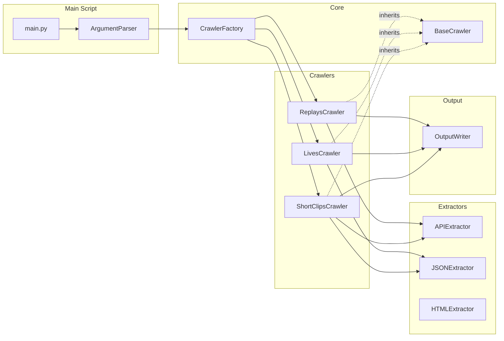
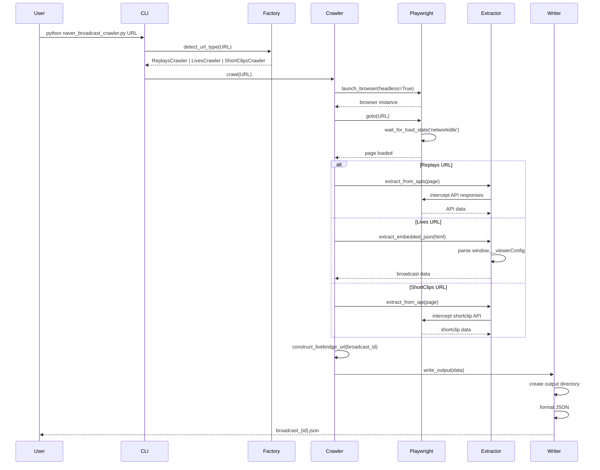
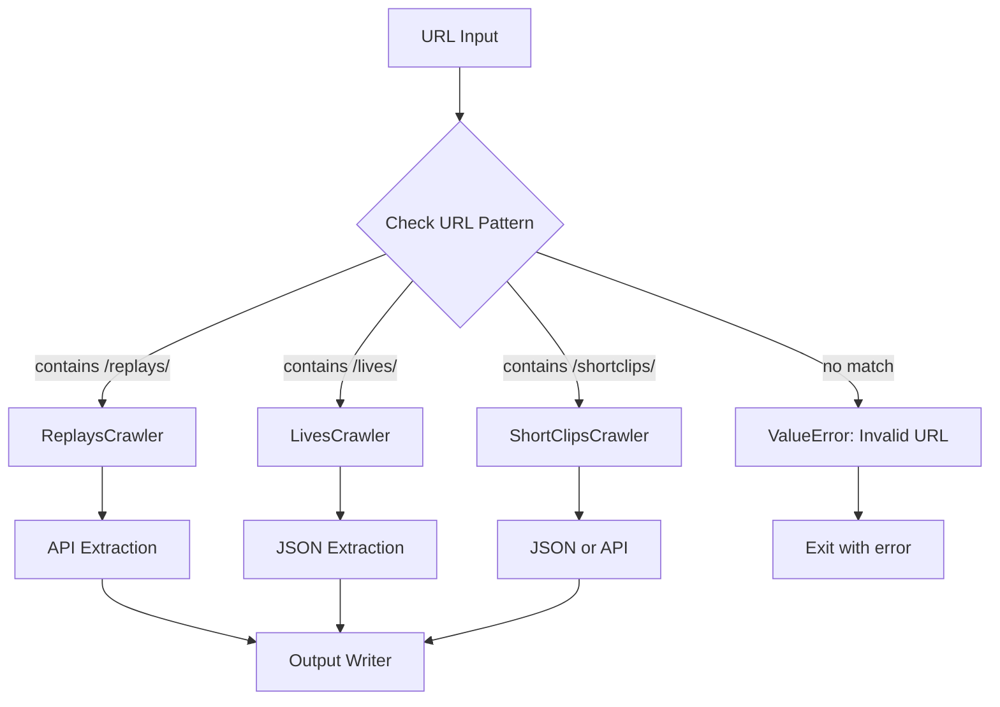
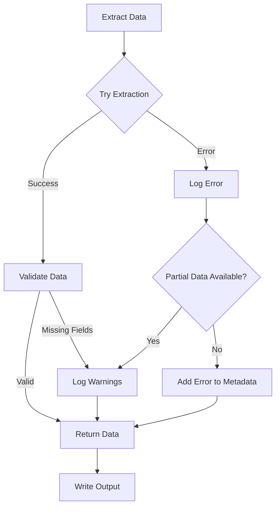

# Design: Naver Shopping Live Crawler

**Feature Name:** Naver Shopping Live Crawler
**Script Name:** `naver_broadcast_crawler.py`
**Date:** 2025-12-23
**Status:** Draft
**Version:** 1.0.0

---

## Table of Contents
1. [Architecture Overview](#architecture-overview)
2. [System Components](#system-components)
3. [Data Flow](#data-flow)
4. [Class Design](#class-design)
5. [Extraction Strategies](#extraction-strategies)
6. [Error Handling](#error-handling)
7. [Output Format](#output-format)
8. [Technical Decisions](#technical-decisions)

---

## Architecture Overview

### High-Level Architecture

```mermaid
graph TB
    User[User] -->|URL| CLI[Command Line Interface]
    CLI --> Factory[Crawler Factory]
    Factory -->|replays| Replays[ReplaysCrawler]
    Factory -->|lives| Lives[LivesCrawler]
    Factory -->|shortclips| ShortClips[ShortClipsCrawler]

    Replays --> API[API Extractor]
    Lives --> JSON[JSON Extractor]
    ShortClips --> JSONAPI[JSON/API Extractor]

    API --> Output[JSON Output Writer]
    JSON --> Output
    JSONAPI --> Output

    Output --> File[broadcast_{id}.json]

    style Replays fill:#e1f5ff
    style Lives fill:#fff4e1
    style ShortClips fill:#f0e1ff
```

### Design Principles

1. **Strategy Pattern**: Different extraction strategies for each URL type
2. **Factory Pattern**: Auto-detect URL type and instantiate appropriate crawler
3. **Single Responsibility**: Each class handles one specific task
4. **Fail-Safe**: Graceful degradation when data unavailable
5. **Idempotency**: Multiple runs produce same output for same input

---

## System Components

### Component Diagram



### Component Responsibilities

| Component | Responsibility | Input | Output |
|-----------|---------------|-------|--------|
| `ArgumentParser` | Parse CLI arguments | `sys.argv` | `args` object |
| `CrawlerFactory` | Detect URL type & create crawler | URL string | Crawler instance |
| `BaseCrawler` | Common crawler logic | URL | Broadcast data dict |
| `ReplaysCrawler` | Extract from replays URLs | Replays URL | Broadcast data |
| `LivesCrawler` | Extract from lives URLs | Lives URL | Broadcast data |
| `ShortClipsCrawler` | Extract from shortclips URLs | ShortClips URL | Broadcast data |
| `APIExtractor` | Intercept & parse API responses | Page, Patterns | Extracted data dict |
| `JSONExtractor` | Parse embedded JSON | HTML string | Parsed JSON dict |
| `HTMLExtractor` | Parse HTML elements | Page | Extracted data dict |
| `OutputWriter` | Write JSON output | Data dict, Path | JSON file |

---

## Data Flow

### Extraction Flow Diagram



### URL Type Detection Flow



---

## Class Design

### Class Hierarchy

```python
# Base class
class BaseCrawler(ABC):
    """Abstract base class for all crawlers"""

    def __init__(self, headless: bool = True):
        self.headless = headless
        self.browser = None
        self.page = None

    @abstractmethod
    async def extract_data(self, url: str) -> dict:
        """Extract broadcast data from URL"""
        pass

    async def crawl(self, url: str) -> dict:
        """Main crawl method with browser lifecycle"""
        # Launch browser
        # Navigate to URL
        # Call extract_data()
        # Close browser
        # Return data

    def construct_livebridge_url(self, broadcast_id: int) -> str:
        """Construct livebridge URL from broadcast ID"""
        return f"https://shoppinglive.naver.com/livebridge/{broadcast_id}"
```

### Concrete Implementations

```python
class ReplaysCrawler(BaseCrawler):
    """Crawler for /replays/ URLs using API interception"""

    async def extract_data(self, url: str) -> dict:
        # Intercept API responses
        # Extract from:
        #   - /v1/broadcast/{id}
        #   - /v2/broadcast/{id}/coupons
        #   - /v1/broadcast/{id}/broadcast-benefits
        #   - /v1/broadcast/{id}/replays/comments
        # Return structured data


class LivesCrawler(BaseCrawler):
    """Crawler for /lives/ URLs using embedded JSON"""

    async def extract_data(self, url: str) -> dict:
        # Get initial HTML
        # Extract window.__viewerConfig.broadcast JSON
        # Parse JSON string
        # Optionally fetch additional APIs
        # Return structured data


class ShortClipsCrawler(BaseCrawler):
    """Crawler for /shortclips/ URLs using API or JSON"""

    async def extract_data(self, url: str) -> dict:
        # Try embedded JSON first (fast)
        # Fallback to /v1/shortclip/{id} API
        # Return structured data
```

### Extractor Classes

```python
class APIExtractor:
    """Extract data from intercepted API responses"""

    def __init__(self):
        self.api_data = {}

    async def setup_interception(self, page):
        """Setup API response interception"""
        page.on('response', self._handle_response)

    async def _handle_response(self, response):
        """Handle API responses"""
        # Check URL pattern
        # Parse JSON body
        # Store in self.api_data

    def get_broadcast_data(self) -> dict:
        """Get main broadcast data from API"""
        return self.api_data.get('broadcast', {})

    def get_coupons(self) -> list:
        """Get coupons from API"""
        return self.api_data.get('coupons', {}).get('coupons', [])


class JSONExtractor:
    """Extract data from embedded JSON in HTML"""

    @staticmethod
    def extract_broadcast_json(html: str) -> dict:
        """Extract window.__viewerConfig.broadcast"""
        pattern = r'window\.__viewerConfig\.broadcast\s*=\s*\'(.+?)\';'
        match = re.search(pattern, html)
        if match:
            json_str = match.group(1)
            return json.loads(json_str)
        return {}

    @staticmethod
    def extract_shortclip_json(html: str) -> dict:
        """Extract window.__viewerConfig.shortclip"""
        pattern = r'window\.__viewerConfig\.shortclip\s*=\s*\'(.+?)\';'
        match = re.search(pattern, html)
        if match:
            json_str = match.group(1)
            return json.loads(json_str)
        return {}


class OutputWriter:
    """Write extracted data to JSON file"""

    def __init__(self, output_dir: Path):
        self.output_dir = output_dir

    def write(self, data: dict, broadcast_id: int) -> Path:
        """Write data to JSON file"""
        self.output_dir.mkdir(parents=True, exist_ok=True)

        output_file = self.output_dir / f"broadcast_{broadcast_id}.json"

        with open(output_file, 'w', encoding='utf-8') as f:
            json.dump(data, f, ensure_ascii=False, indent=2)

        return output_file
```

---

## Extraction Strategies

### Replays URLs: API Interception

**Strategy:** Pure API interception

**APIs to Capture:**
1. `/v1/broadcast/{id}?needTimeMachine=true` → Main broadcast data
2. `/v2/broadcast/{id}/coupons` → Coupons list
3. `/v1/broadcast/{id}/broadcast-benefits` → Benefits
4. `/v1/broadcast/{id}/replays/comments` → Comments

**Data Mapping:**

| Output Field | API Source | JSON Path |
|--------------|------------|-----------|
| broadcast_id | broadcast API | `id` |
| title | broadcast API | `title` |
| brand_name | broadcast API | `nickname` |
| description | broadcast API | `description` |
| broadcast_date | broadcast API | `startDate` |
| broadcast_end_date | broadcast API | `endDate` |
| expected_start_date | broadcast API | `expectedStartDate` |
| status | broadcast API | `status` |
| replay_url | broadcast API | `broadcastReplayEndUrl` |
| broadcast_url | broadcast API | `broadcastEndUrl` |
| products | broadcast API | `shoppingProducts[]` |
| coupons | coupons API | `coupons[]` |
| live_benefits | benefits API | `[...]` (array) |
| live_chat | comments API | `comments[]` |

**Wait Strategy:**
- Wait for `networkidle` state
- Additional 8-10 second wait for late-loading APIs
- Proceed even if some APIs missing

---

### Lives URLs: Embedded JSON Parsing

**Strategy:** Parse `window.__viewerConfig.broadcast` JSON

**Embedded JSON Structure:**
```javascript
window.__viewerConfig.broadcast = '{
  "id": 1810235,
  "title": "💘래피즈 연말&크리스마스 선물 UPTO 38%💘",
  "nickname": "REPIZ",
  "shoppingProducts": [...],
  ...
}'
```

**Data Mapping:**

| Output Field | JSON Source | JSON Path |
|--------------|-------------|-----------|
| broadcast_id | embedded JSON | `id` |
| title | embedded JSON | `title` |
| brand_name | embedded JSON | `nickname` |
| description | embedded JSON | `description` |
| broadcast_date | embedded JSON | `startDate` |
| broadcast_end_date | embedded JSON | `endDate` |
| expected_start_date | embedded JSON | `expectedStartDate` |
| status | embedded JSON | `status` |
| replay_url | embedded JSON | `broadcastReplayEndUrl` (or construct) |
| broadcast_url | embedded JSON | `broadcastEndUrl` |
| products | embedded JSON | `shoppingProducts[]` |
| coupons | embedded JSON / API | `[]` (usually empty, optionally fetch API) |
| live_benefits | API fallback | `/v1/broadcast/{id}/broadcast-benefits` |
| live_chat | embedded JSON | `[]` (not in JSON, would need HTML parsing) |

**Extraction Steps:**
1. Load page and get initial HTML
2. Extract embedded JSON with regex
3. Parse JSON string
4. Optionally fetch benefits API for complete data
5. Construct missing URLs if needed

**Benefits:**
- ✅ Fastest (no wait for JavaScript)
- ✅ Most reliable (data in initial response)
- ✅ No API rate limiting concerns

---

### ShortClips URLs: Hybrid Approach

**Strategy:** Try embedded JSON first, fallback to API

**Option 1: Embedded JSON**
```javascript
window.__viewerConfig.shortclip = '{...}'
```

**Option 2: API**
```
/v1/shortclip/{id} → Full shortclip data
```

**Data Mapping:**
Same as Lives, but with `window.__viewerConfig.shortclip` or shortclip API

---

## Error Handling

### Error Handling Strategy



### Error Categories

| Category | Handling | Exit Code | Output |
|----------|----------|-----------|--------|
| **Network Timeout** | Retry once, then fail | 1 | Partial data + error metadata |
| **Invalid URL** | Fail immediately | 2 | No output, error message |
| **Missing Field** | Log warning, continue | 0 | Partial data, field = null |
| **JSON Parse Error** | Try fallback, log error | 0/1 | Partial data if fallback works |
| **API Error (4xx/5xx)** | Log, skip that API | 0 | Data without that API's fields |
| **Browser Launch Error** | Fail immediately | 3 | No output, error message |

### Error Logging Format

```python
{
  "metadata": {
    "errors": [
      {
        "timestamp": "2025-12-23T10:30:45.123",
        "type": "APIError",
        "message": "Failed to fetch coupons API: 404 Not Found",
        "url": "/v2/broadcast/1810235/coupons",
        "severity": "warning"
      }
    ],
    "warnings": [
      {
        "field": "live_chat",
        "message": "No comments available for this broadcast",
        "fallback_value": []
      }
    ]
  }
}
```

---

## Output Format

### JSON Schema

```json
{
  "$schema": "http://json-schema.org/draft-07/schema#",
  "type": "object",
  "required": ["metadata", "broadcast"],
  "properties": {
    "metadata": {
      "type": "object",
      "properties": {
        "crawled_at": {"type": "string", "format": "date-time"},
        "source_url": {"type": "string", "format": "uri"},
        "extraction_method": {"enum": ["API", "JSON", "HYBRID"]},
        "url_type": {"enum": ["replays", "lives", "shortclips"]},
        "crawler_version": {"type": "string"},
        "errors": {"type": "array"},
        "warnings": {"type": "array"}
      }
    },
    "broadcast": {
      "type": "object",
      "required": ["broadcast_id", "title", "brand_name"],
      "properties": {
        "broadcast_id": {"type": "integer"},
        "replay_url": {"type": "string", "format": "uri"},
        "broadcast_url": {"type": "string", "format": "uri"},
        "livebridge_url": {"type": "string", "format": "uri"},
        "title": {"type": "string"},
        "brand_name": {"type": "string"},
        "description": {"type": "string"},
        "broadcast_date": {"type": "string", "format": "date-time"},
        "broadcast_end_date": {"type": ["string", "null"], "format": "date-time"},
        "expected_start_date": {"type": ["string", "null"], "format": "date-time"},
        "status": {"type": "string"},
        "coupons": {"type": "array"},
        "products": {"type": "array"},
        "live_benefits": {"type": "array"},
        "live_chat": {"type": "array"}
      }
    }
  }
}
```

### Example Output

```json
{
  "metadata": {
    "crawled_at": "2025-12-23T14:30:00.000Z",
    "source_url": "https://view.shoppinglive.naver.com/replays/1776510",
    "extraction_method": "API",
    "url_type": "replays",
    "crawler_version": "1.0.0"
  },
  "broadcast": {
    "broadcast_id": 1776510,
    "replay_url": "https://view.shoppinglive.naver.com/replays/1776510",
    "broadcast_url": "https://view.shoppinglive.naver.com/lives/1776510?tr=lim",
    "livebridge_url": "https://shoppinglive.naver.com/livebridge/1776510",
    "title": "[강세일]베스트 어워즈💙특집 라이브(~40%+트리플 혜택)",
    "brand_name": "아이오페",
    "description": "아이오페 베스트템💙+혜택",
    "broadcast_date": "2025-12-03T19:58:13.344",
    "broadcast_end_date": "2025-12-03T21:02:20",
    "expected_start_date": "2025-12-03T20:00:00",
    "status": "BLOCK",
    "coupons": [
      {
        "title": "❤️‍🔥향수❤️‍🔥 뷰티 홀리데이 연말마켓 10% 쿠폰",
        "benefit_type": "ADMIN_COUPON",
        "benefit_unit": "PERCENT",
        "benefit_value": 10,
        "min_order_amount": 300000,
        "max_discount_amount": 70000,
        "valid_start": "2025-12-23T00:00:00+09:00",
        "valid_end": "2025-12-23T23:59:59.999+09:00"
      }
    ],
    "products": [
      {
        "product_id": "5237425925",
        "name": "아이오페 NEW 6세대 슈퍼바이탈 크림 50ml",
        "brand_name": "아이오페",
        "discount_rate": 23,
        "discounted_price": 100100,
        "original_price": 100100,
        "stock": 1196,
        "image": "https://shop-phinf.pstatic.net/...",
        "link": "https://product.shoppinglive.naver.com/...",
        "review_count": 18105,
        "delivery_fee": 2500
      }
    ],
    "live_benefits": [
      {
        "id": 1562855,
        "message": "[라이브 더 적립]❣️적립 최대10%",
        "detail": "🔻라이브에서만 더! 적립🔻 최대 10%...",
        "type": "ONAIR"
      }
    ],
    "live_chat": [
      {
        "nickname": "볼탱이",
        "message": "안녕하세용!!!",
        "created_at": "2025-12-03T19:51:50.215",
        "comment_type": "CHATTING"
      }
    ]
  }
}
```

---

## Technical Decisions

### Decision Log

#### Decision 1: Headless vs Headful Browser
**Decision:** Default to headless, optionallow headful via `--headful` flag

**Rationale:**
- Headless mode runs in background (user requirement)
- Headful useful for debugging
- Playwright supports both modes easily

**Alternatives Considered:**
- Always headless: Harder to debug
- Always headful: Annoying for users

---

#### Decision 2: Extraction Method per URL Type
**Decision:** Different extraction strategies for each URL type

**Rationale:**
- Investigation showed each type has optimal extraction method:
  - Replays: API has most complete data
  - Lives: Embedded JSON is fastest and most reliable
  - ShortClips: Either JSON or API works
- Using optimal method for each type maximizes speed and reliability

**Alternatives Considered:**
- Pure HTML parsing: Slower, less reliable, incomplete data
- Pure API for all: Lives doesn't have main broadcast API

---

#### Decision 3: Wait Strategy for APIs
**Decision:** `networkidle` + 8-10 second additional wait

**Rationale:**
- Some APIs load after `networkidle` event
- Investigation showed 8-10 seconds captures all APIs
- User willing to wait for complete data

**Alternatives Considered:**
- Wait for specific APIs: Complex to detect
- Shorter wait: Might miss late-loading APIs
- Longer wait: Unnecessarily slow

---

#### Decision 4: Single Broadcast per Execution
**Decision:** Phase 1 only crawls single broadcast (no multi-broadcast navigation)

**Rationale:**
- User requirement for Phase 1
- Simpler implementation
- Multi-broadcast deferred to Phase 2

**Alternatives Considered:**
- Implement multi-broadcast now: More complex, out of scope

---

#### Decision 5: Livebridge URL Construction
**Decision:** Construct `https://shoppinglive.naver.com/livebridge/{broadcast_id}` from ID

**Rationale:**
- User requirement
- Simple string formatting
- Always follows same pattern

**Alternatives Considered:**
- Fetch from API: Not available in API responses

---

#### Decision 6: Error Handling Philosophy
**Decision:** Fail-safe with warnings, not fail-fast

**Rationale:**
- Missing some fields better than no output
- Allows partial data extraction
- User can see what's missing and why

**Alternatives Considered:**
- Fail-fast: Would lose all data on minor errors
- Silent failures: User wouldn't know what's missing

---

#### Decision 7: Output File Naming
**Decision:** `broadcast_{broadcast_id}.json` in `crawler/cj/output/` directory

**Rationale:**
- Broadcast ID is unique identifier
- Easy to find specific broadcast
- Overwrites old data (idempotent)
- Organized in dedicated output directory

**Alternatives Considered:**
- Timestamp-based naming: Harder to find specific broadcast
- Random UUID: Not human-readable
- Current directory: Clutters workspace

---

## Implementation Notes

### File Structure

```
crawler/cj/
├── naver_broadcast_crawler.py  # Main script (entry point)
├── crawlers/
│   ├── __init__.py
│   ├── base_crawler.py         # BaseCrawler abstract class
│   ├── replays_crawler.py      # ReplaysCrawler
│   ├── lives_crawler.py        # LivesCrawler
│   └── shortclips_crawler.py   # ShortClipsCrawler
├── extractors/
│   ├── __init__.py
│   ├── api_extractor.py        # APIExtractor
│   ├── json_extractor.py       # JSONExtractor
│   └── html_extractor.py       # HTMLExtractor (future)
├── utils/
│   ├── __init__.py
│   ├── output_writer.py        # OutputWriter
│   └── url_detector.py         # URL type detection
└── output/                     # Output directory
    └── broadcast_*.json        # Generated files
```

### Dependencies

```python
# requirements.txt
playwright>=1.40.0
```

### Installation Steps

```bash
# Install Python dependencies
pip install -r requirements.txt

# Install Playwright browsers
playwright install chromium
```

### Testing Strategy

See `docs/ai/testing/feature-naver-shopping-live-crawler.md` for detailed testing strategy.

**Unit Tests:**
- URL type detection
- JSON extraction from HTML
- API data parsing
- Livebridge URL construction

**Integration Tests:**
- Full extraction from replays URL
- Full extraction from lives URL
- Full extraction from shortclips URL

**End-to-End Tests:**
- Complete crawl workflow
- Output file validation
- Error handling scenarios

---

## Performance Considerations

### Expected Performance

| URL Type | Page Load | API Wait | Total | Memory |
|----------|-----------|----------|-------|--------|
| Replays | 3-5s | 8-10s | 11-15s | ~300 MB |
| Lives | 2-3s | 0s (JSON) | 2-3s | ~200 MB |
| ShortClips | 2-3s | 0-5s | 2-8s | ~200 MB |

### Optimization Opportunities

1. **Lives URLs:** Fastest due to embedded JSON (no API wait)
2. **Replays URLs:** Consider parallel API requests in future
3. **Memory:** Browser instance is main memory consumer
4. **Disk:** JSON files typically 50-200 KB each

---

## Security Considerations

1. **SSL Certificates:** Ignored (as required for Naver pages)
2. **Input Validation:** URL pattern validation before processing
3. **Output Sanitization:** JSON encoding handles special characters
4. **Rate Limiting:** Single broadcast per run, no aggressive crawling
5. **User Agent:** Standard browser UA, not attempting to hide identity

---

## Monitoring and Logging

### Log Levels

- **INFO:** Normal operation (page loaded, extraction started/completed)
- **WARNING:** Missing optional fields, fallback to alternative method
- **ERROR:** Failed to extract required fields, API errors

### Log Format

```
2025-12-23 14:30:00 [INFO] Starting crawler for URL: https://view.shoppinglive.naver.com/replays/1776510
2025-12-23 14:30:01 [INFO] Detected URL type: replays
2025-12-23 14:30:02 [INFO] Launching browser in headless mode
2025-12-23 14:30:05 [INFO] Page loaded, waiting for APIs...
2025-12-23 14:30:14 [INFO] Captured broadcast API response
2025-12-23 14:30:14 [INFO] Captured coupons API response
2025-12-23 14:30:15 [WARNING] Benefits API not loaded, data may be incomplete
2025-12-23 14:30:15 [INFO] Extracted 20 products, 11 coupons, 0 benefits, 100 comments
2025-12-23 14:30:15 [INFO] Writing output to: crawler/cj/output/broadcast_1776510.json
2025-12-23 14:30:15 [INFO] Crawl completed successfully
```

---

## Appendix

### Related Documents
- Requirements: `docs/ai/requirements/feature-naver-shopping-live-crawler.md`
- Testing: `docs/ai/testing/feature-naver-shopping-live-crawler.md` (to be created)
- Implementation: `docs/ai/implementation/feature-naver-shopping-live-crawler.md` (to be created)

### Investigation References
- `crawler/cj/INVESTIGATION_FINDINGS.md` - Detailed investigation findings
- `crawler/cj/DATA_SOURCE_ANALYSIS.md` - Data source deep dive
- `crawler/cj/investigate_*.py` - Investigation scripts

### Example Test URLs
- **Replays:** `https://view.shoppinglive.naver.com/replays/1776510`
- **Lives:** `https://view.shoppinglive.naver.com/lives/1810235?tr=lim`
- **ShortClips:** `https://view.shoppinglive.naver.com/shortclips/9797637?tr=sclim`
