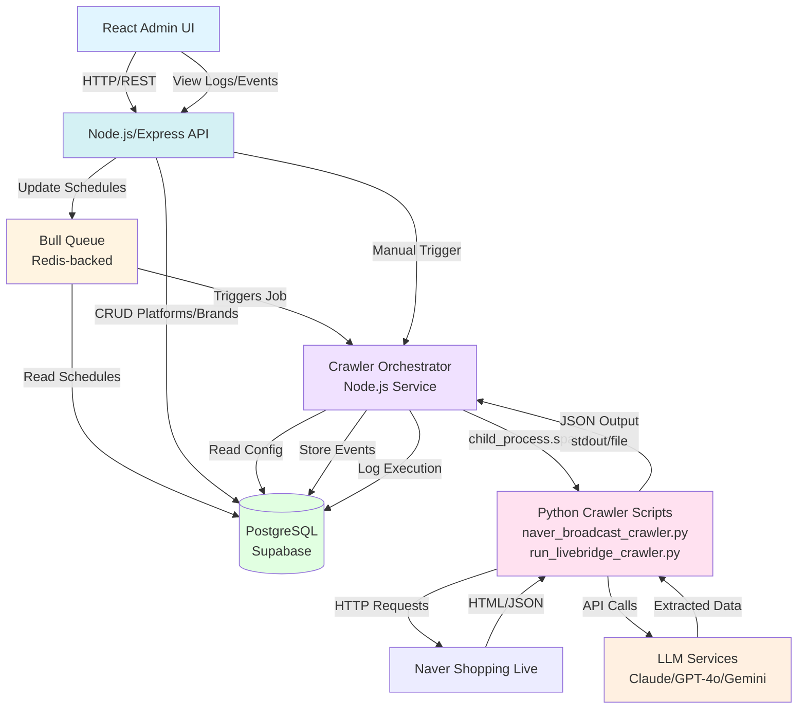

# System Design & Architecture

## Architecture Overview
**What is the high-level system structure?**



**Key Components:**
1. **Admin Interface**: Web UI for managing platforms, brands, schedules, and viewing logs
2. **Backend API**: RESTful API for CRUD operations on platforms/brands and manual crawl triggers
3. **Job Scheduler**: Automated scheduler that triggers crawls based on configured schedules
4. **Crawler Service**: Orchestrates crawler script execution, LLM extraction, and data storage
5. **Database**: Stores platforms, brands, events, and execution logs
6. **Existing Crawler Scripts**: `naver_broadcast_crawler.py` and `run_livebridge_crawler.py`

**Technology Stack:**
- **Backend**: Node.js 18+ with Express.js 4.18.2
- **Scheduler**: Bull 4.x (Redis-based job queue)
- **Database**: PostgreSQL via Supabase (@supabase/supabase-js 2.86.0 + pg 8.11.3)
- **Admin UI**: React (extend existing frontend in `/home/long/ai_cs/frontend/`)
- **Crawler Scripts**: Python 3.x (invoked via Node.js child_process.spawn)
- **LLM Service**: Already implemented in Python
  - Claude 3.5 Haiku (`claude-3-5-haiku-20241022`)
  - GPT-4o Mini (`gpt-4o-mini`)
  - Gemini 1.5 Flash (`gemini-1.5-flash`)
  - Located in: `/home/long/ai_cs/crawler/cj/vision_extractor.py` and `llm_extractor.py`

## Data Models
**What data do we need to manage?**

### Core Entities

**Platform**
```python
{
  "id": "uuid",
  "name": "string",              # e.g., "Naver Shopping Live"
  "url_pattern": "string",       # e.g., "https://shoppinglive.naver.com/search/lives?query={query}"
  "status": "enum",              # active | inactive
  "schedule_cron": "string",     # e.g., "0 */6 * * *" (every 6 hours)
  "created_at": "timestamp",
  "updated_at": "timestamp"
}
```

**Brand**
```python
{
  "id": "uuid",
  "name": "string",              # e.g., "Sulwhasoo"
  "search_text": "string",       # e.g., "설화수"
  "platform_id": "uuid",         # FK to Platform
  "status": "enum",              # active | inactive
  "schedule_cron": "string",     # Override platform schedule if set
  "created_at": "timestamp",
  "updated_at": "timestamp"
}
```

**CrawlerExecution**
```python
{
  "id": "uuid",
  "brand_id": "uuid",            # FK to Brand
  "platform_id": "uuid",         # FK to Platform
  "trigger_type": "enum",        # scheduled | manual
  "status": "enum",              # pending | running | success | failed
  "started_at": "timestamp",
  "completed_at": "timestamp",
  "items_found": "integer",
  "error_message": "string",     # If failed
  "created_at": "timestamp"
}
```

**Event** (crawled live/replay event)
```python
{
  "id": "uuid",
  "external_id": "string",       # Unique ID from platform
  "brand_id": "uuid",            # FK to Brand
  "platform_id": "uuid",         # FK to Platform
  "execution_id": "uuid",        # FK to CrawlerExecution (which execution created/updated this)
  "title": "string",
  "url": "string",
  "start_date": "timestamp",
  "end_date": "timestamp",
  "status": "enum",              # upcoming | ongoing | ended
  "event_type": "enum",          # live | replay
  "raw_data": "json",            # Original crawled data
  "extracted_data": "json",      # LLM extracted data
  "created_at": "timestamp",
  "updated_at": "timestamp"
}
```

**CrawlerConfig** (system-wide settings)
```python
{
  "id": "uuid",
  "key": "string",               # e.g., "past_days_range", "future_days_range"
  "value": "string",             # e.g., "7", "14"
  "description": "string",
  "updated_at": "timestamp"
}
```

**Data Relationships:**
- One Platform → Many Brands
- One Brand → Many Events
- One Brand → Many CrawlerExecutions
- One CrawlerExecution → Many Events (created during that execution)

## API Design
**How do components communicate?**

### Platform Management
- `GET /api/platforms` - List all platforms
- `POST /api/platforms` - Create platform
- `GET /api/platforms/{id}` - Get platform details
- `PUT /api/platforms/{id}` - Update platform
- `DELETE /api/platforms/{id}` - Delete platform

### Brand Management
- `GET /api/brands` - List all brands (with filter by platform)
- `POST /api/brands` - Create brand
- `GET /api/brands/{id}` - Get brand details
- `PUT /api/brands/{id}` - Update brand
- `DELETE /api/brands/{id}` - Delete brand

### Crawler Operations
- `POST /api/crawler/trigger` - Manually trigger crawl
  - Body: `{ "brand_id": "uuid", "platform_id": "uuid" }`
- `GET /api/crawler/executions` - List crawler execution history
- `GET /api/crawler/executions/{id}` - Get execution details

### Configuration
- `GET /api/config` - Get all configuration settings
- `PUT /api/config/{key}` - Update configuration setting

### Events (optional, for viewing crawled data)
- `GET /api/events` - List events (with filters)
- `GET /api/events/{id}` - Get event details

**Authentication:**
- Internal use only - basic authentication or session-based auth
- Admin-only access for all endpoints

## Component Breakdown
**What are the major building blocks?**

### Backend Services

**1. Platform Service**
- CRUD operations for platforms
- Validation of URL patterns
- Schedule management

**2. Brand Service**
- CRUD operations for brands
- Association with platforms
- Schedule inheritance/override logic

**3. Crawler Orchestrator (Node.js Service)**
- Main service that coordinates crawling
- Implementation: `/home/long/ai_cs/backend/src/services/crawlerOrchestratorService.js`
- Responsibilities:
  - Read brand/platform config from database (via Supabase client)
  - Construct search URL from platform URL pattern + brand search text
  - Execute Python crawler scripts via Node.js `child_process.spawn()`
  - Pass parameters: URL, time filters (--start-date, --end-date)
  - Parse crawler output (JSON stdout or file output)
  - Store events in PostgreSQL database (via Supabase)
  - Log execution details (status, items found, errors) to `crawler_executions` table
  - Handle duplicate detection using `(platform_id, external_id)` composite key
  - LLM extraction happens automatically within Python crawlers (already implemented)

**Crawler Invocation Pattern:**
```javascript
const { spawn } = require('child_process');

const crawlerProcess = spawn('python3', [
  '/home/long/ai_cs/crawler/cj/run_livebridge_crawler.py',
  searchUrl,
  '--no-save-json',  // Let Node.js handle DB storage
  '--vision-provider', 'gpt-4o-mini'
], {
  cwd: '/home/long/ai_cs/crawler/cj',
  env: { ...process.env }
});
```

**4. Scheduler Service (Node.js)**
- Job scheduling using Bull (Redis-backed) or Agenda (MongoDB-backed)
- Recommendation: **Bull** (already have Redis in package.json dependencies)
- Implementation: `/home/long/ai_cs/backend/src/services/schedulerService.js`
- Dynamic job registration based on platform/brand schedules from database
- Triggers Crawler Orchestrator at scheduled times (via cron expressions)
- Handles schedule updates (add/remove/modify jobs) when brands/platforms are updated
- Job persistence and recovery after server restart
- Concurrent job execution with configurable limits

**Job Definition Example (Bull):**
```javascript
const Queue = require('bull');
const crawlerQueue = new Queue('crawler-jobs', {
  redis: { host: 'localhost', port: 6379 }
});

// Add repeating job
crawlerQueue.add('crawl-brand',
  { brandId, platformId },
  { repeat: { cron: '0 */6 * * *' } }  // Every 6 hours
);
```

**5. LLM Extraction**
- Already fully implemented in Python crawlers
- Location: `/home/long/ai_cs/crawler/cj/vision_extractor.py` and `llm_extractor.py`
- Supports multiple providers: Claude Haiku, GPT-4o Mini, Gemini Flash
- Extraction happens during crawl (controlled by `--no-llm` flag)
- No additional Node.js wrapper needed - crawlers handle this internally

### Database Layer
- **Database**: PostgreSQL via Supabase
- **Connection**: Dual approach
  1. Direct PostgreSQL via `pg` library (connection pool in `/home/long/ai_cs/backend/src/config/database.js`)
  2. Supabase SDK via `@supabase/supabase-js` (client in `/home/long/ai_cs/backend/src/config/supabase.js`)
- **Schema Management**: SQL migration scripts in `/home/long/ai_cs/database/`
- **Tables to Create**:
  - `platforms` - Platform configurations
  - `brands` - Brand configurations with FK to platforms
  - `crawler_executions` - Execution logs
  - `crawler_config` - System configuration (time ranges, etc.)
  - Extend existing `live_broadcasts` or create new `events` table for crawled data
- **Indexing** (for efficient queries):
  ```sql
  CREATE INDEX idx_brands_platform_id ON brands(platform_id);
  CREATE INDEX idx_events_brand_id ON events(brand_id);
  CREATE INDEX idx_events_platform_id ON events(platform_id);
  CREATE INDEX idx_events_start_date ON events(start_date);
  CREATE UNIQUE INDEX idx_events_unique ON events(platform_id, external_id);
  CREATE INDEX idx_executions_brand_id ON crawler_executions(brand_id);
  CREATE INDEX idx_executions_status ON crawler_executions(status);
  ```
- **Duplicate Detection**: Composite unique constraint on `(platform_id, external_id)`
- **Transaction Support**: Use `pg` connection pool for ACID transactions

### Admin Interface
- **Framework**: React (extend existing frontend in `/home/long/ai_cs/frontend/`)
- **State Management**: Zustand (already used in existing frontend)
- **API Communication**: Axios or fetch (consistent with existing code)
- **UI Components**:
  - Platform management UI (list, create, edit, delete)
  - Brand management UI (list, create, edit, delete)
  - Manual crawl trigger interface with real-time status updates
  - Execution history viewer with filters (brand, platform, status, date range)
  - Configuration settings page (time ranges, crawler options)
- **Routing**: React Router (add new routes to existing app)
- **New Routes**:
  - `/admin/platforms` - Platform management
  - `/admin/brands` - Brand management
  - `/admin/crawler/history` - Execution history
  - `/admin/crawler/config` - Configuration settings

### Integration Architecture (Node.js ↔ Python)

**Communication Pattern:**
```
┌─────────────┐      ┌──────────────────┐      ┌──────────────────┐
│   Node.js   │      │   child_process  │      │  Python Crawler  │
│   Backend   │─────▶│     spawn()      │─────▶│     Scripts      │
│             │◀─────│   stdout/stderr  │◀─────│                  │
└─────────────┘      └──────────────────┘      └──────────────────┘
```

**Data Flow:**
1. Node.js Scheduler triggers job
2. Crawler Orchestrator service prepares parameters
3. Spawns Python crawler with arguments (URL, dates, LLM provider)
4. Python crawler executes, extracts data with LLM
5. Returns JSON via stdout or writes to temp file
6. Node.js parses output and stores in PostgreSQL
7. Updates execution log with results

**Error Handling:**
- Capture stderr from Python process
- Timeout detection (kill process after 10 minutes)
- Exit code checking (non-zero = failure)
- Parse error messages and store in execution log

## Design Decisions
**Why did we choose this approach?**

**1. Separate Crawler Orchestrator from API**
- **Rationale**: API handles user requests, Orchestrator handles background jobs. Clean separation of concerns.
- **Alternative**: Combined service - rejected due to complexity and scalability concerns.

**2. Per-Brand and Per-Platform Scheduling**
- **Rationale**: Flexibility to adjust crawl frequency based on brand importance or platform characteristics.
- **Alternative**: Single global schedule - rejected due to lack of granularity.

**3. Immediate LLM Extraction**
- **Rationale**: Simplifies workflow, ensures data is ready for use immediately.
- **Alternative**: Batch processing later - rejected as it adds complexity and delays data availability.

**4. Last Write Wins for Duplicates**
- **Rationale**: Simple conflict resolution, ensures latest data is retained.
- **Alternative**: Version tracking or merge strategies - rejected as overkill for this use case.

**5. Execution Logging as Separate Entity**
- **Rationale**: Provides audit trail and debugging capability independent of event data.
- **Alternative**: Embed in events - rejected due to data model complexity.

**6. Configurable Time Ranges**
- **Rationale**: Allows adjustment without code changes as requirements evolve.
- **Alternative**: Hardcoded values - rejected due to inflexibility.

**7. Node.js Backend with Python Crawlers**
- **Rationale**:
  - Keep existing Node.js/Express backend (no rewrite needed)
  - Reuse existing Python crawler scripts (already implemented and tested)
  - LLM integration already working in Python
- **Alternative**: Rewrite crawlers in JavaScript - rejected due to:
  - Significant development effort
  - Loss of existing LLM integration
  - Python ecosystem better for web scraping (BeautifulSoup, Playwright, etc.)
- **Trade-off**: Inter-process communication overhead (minimal, acceptable for async jobs)

**8. Bull Queue for Job Scheduling**
- **Rationale**:
  - Redis already in dependencies (redis: ^4.6.11)
  - Mature, production-tested library
  - Excellent cron support
  - Built-in job persistence and recovery
  - Web UI available (bull-board) for monitoring
- **Alternatives Considered**:
  - **Agenda**: MongoDB-based, but no MongoDB in stack
  - **node-cron**: Simple but lacks persistence, job management, and concurrency control
  - **Bree**: Good but less mature ecosystem than Bull
- **Decision**: Bull (with existing Redis)

## Non-Functional Requirements
**How should the system perform?**

**Performance Targets:**
- API response time: < 2 seconds for CRUD operations
- Crawler execution: < 5 minutes per brand/platform
- Support at least 20 concurrent brand/platform configurations
- Database queries: < 500ms for typical queries

**Scalability Considerations:**
- Scheduler should support 100+ jobs without performance degradation
- Database should handle 10,000+ events efficiently
- Crawler service should support parallel execution for different brands

**Security Requirements:**
- Admin authentication required for all operations
- Input validation for all user-provided data (SQL injection, XSS prevention)
- Secure storage of configuration data
- No exposure of internal crawler logic to external services

**Reliability/Availability:**
- Failed crawls should not crash the system
- Scheduler should recover gracefully after system restart
- Database transactions to ensure data consistency
- Retry logic for transient failures (network issues, rate limits)
- Logging for all critical operations

**Maintainability:**
- Clear separation of concerns (API, Scheduler, Crawler)
- Comprehensive logging for debugging
- Easy to add new platforms or crawler scripts
- Configuration-driven behavior (minimize hardcoding)
